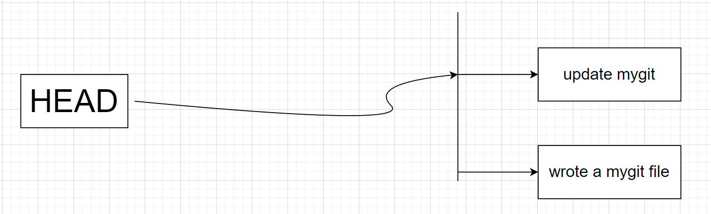
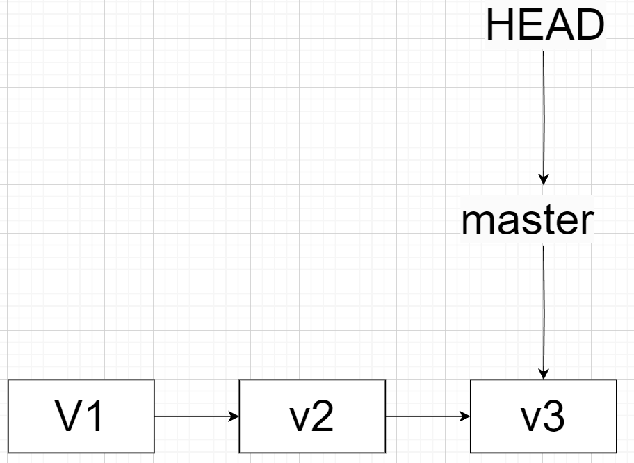
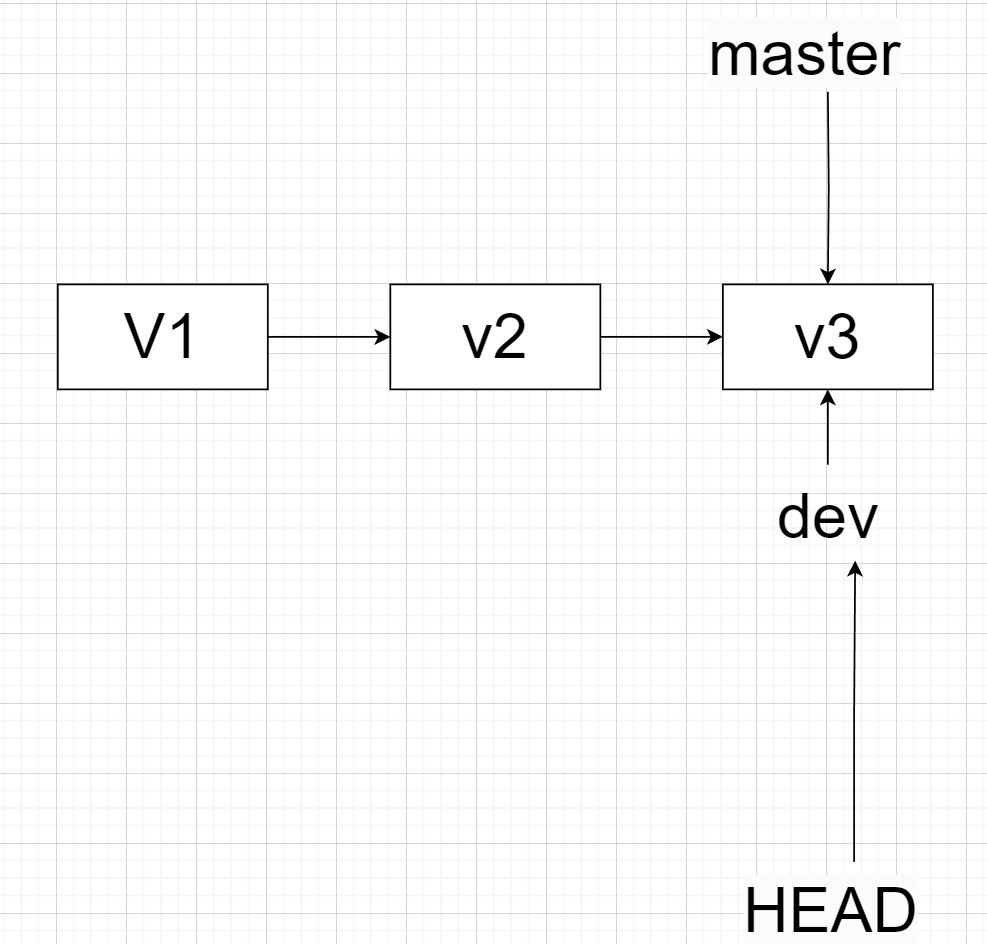
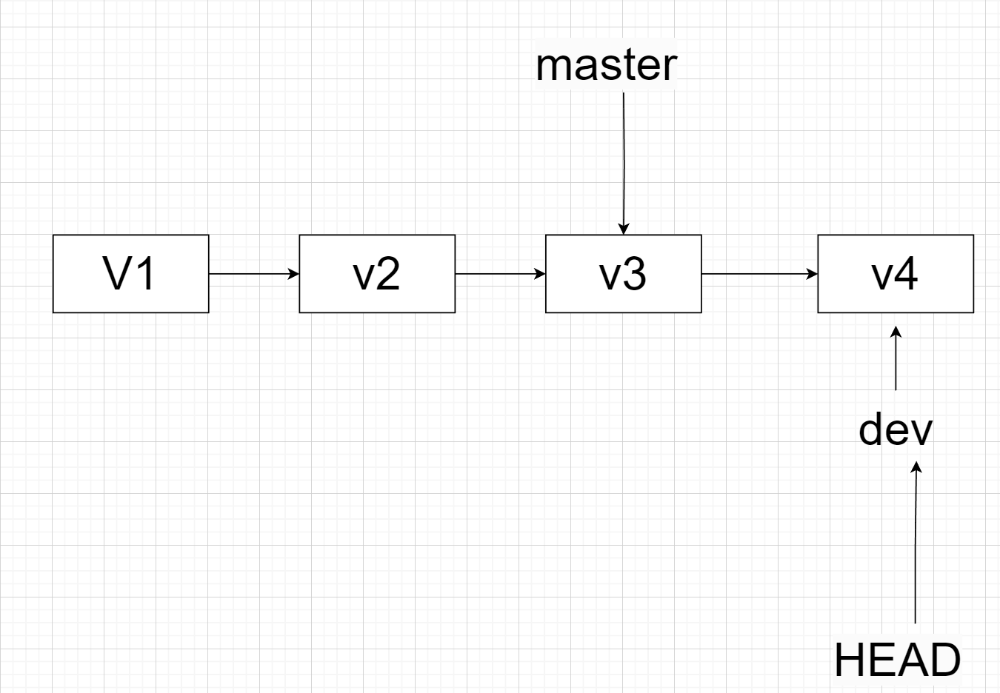
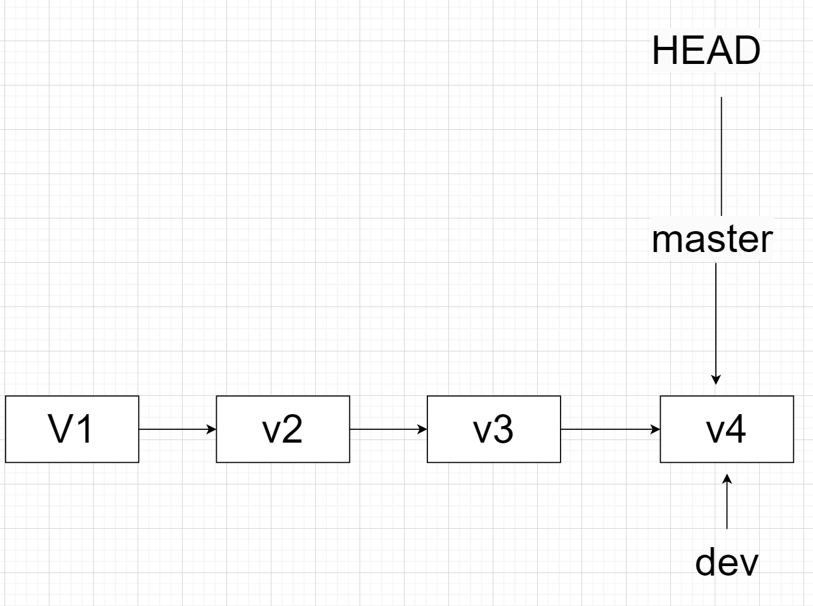
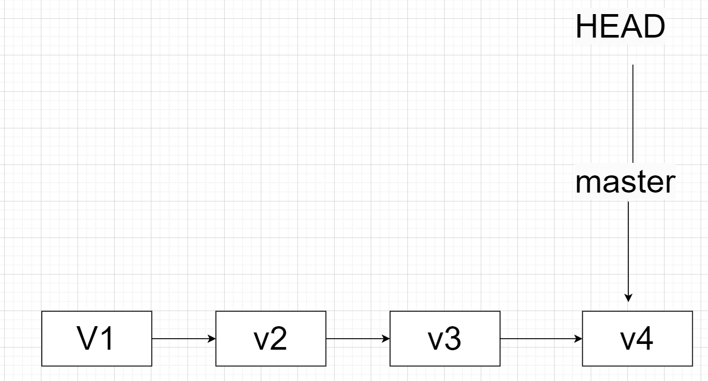
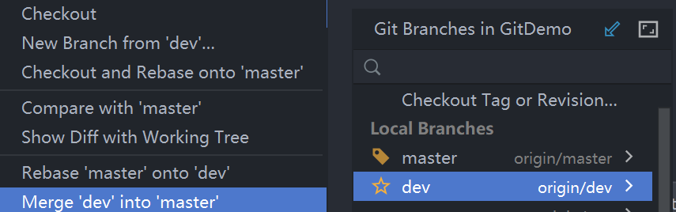
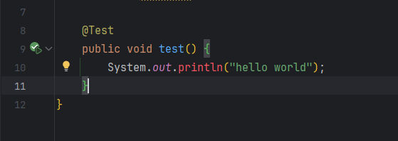
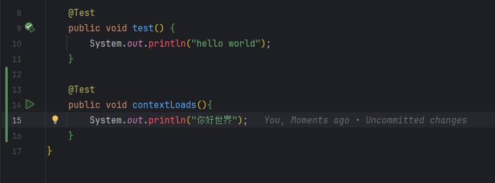
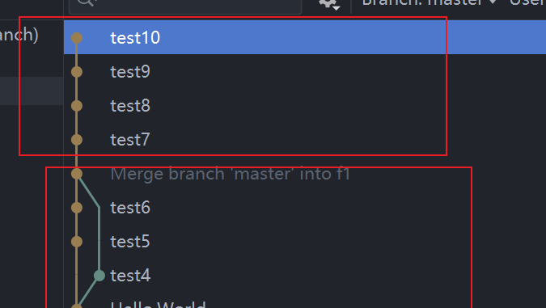

# 集中式与分布式

---

​	集中式版本控制系统（CVCS）和分布式版本控制系统（DVCS）之间存在一些关键的区别，这些区别主要涉及到存储结构、操作方式以及团队协作方面。

## 存储结构

---

### 集中式版本控制系统（CVCS）

1. **中央服务器存储：**
   - 所以版本信息都集中纯粹在一个中央服务器上。
   - 开发者在进行任何版本控制操作时，需要与中央服务器进行通信，包括检出、提交、拉去和推送。
2. **依赖中央服务器：**
   - 开发者的工作区通常只包含他们当前所需的文件，而不是整个项目的完整历史。
   - 每次操作都需要与中央服务器同步，依赖于中央服务器的可用性和性能。
3. 协同工作依赖中央服务器：
   - 分支、合并等协同工作的操作都需要通过中央服务器来协调。
   - 如果中央服务器出现故障或网络问题，协同工作可能受到影响。

### 分布式版本控制系统（DVCS）

1. **每个开发者拥有完整存储库副本：**
   - 每个开发者克隆（Clone）整个存储库，包括完整的项目历史和所有文件。
   - 开发者的本地存储库包含了整个项目的快照，使其成为一个完整的、独立的存储库。
2. **本地操作：**
   - 大多数操作，包含提交、分支创建、合并等，都可以在本地完成。
   - 开发者在本地工作区有整个项目的快照，无需频繁与中央服务器通信。
3. **不依赖中央服务器：**
   - 开发者的本地存储库是一个完整的、独立的实体，不依赖与中央服务器的存活或网络连接。
   - 即使中央服务器不可用，开发者仍然可以继续工作、提交变更和创建分支。
4. **灵活的协同工作：**
   - 分支、合并等协同工作的操作可以在本地完成，冲突通常在本地解决。
   - 变更在需要共享时，可以推送到远程仓库，与其他开发者共享。

​	总体而言，CVCS 强调集中存储和依赖中央服务器的特性，而 DVCS 强调每个开发者拥有完整存储库副本、本地操作和不依赖中央服务器的特性。

## 操作速度

---

### 集中式版本控制系统（CVCS）

1. **依赖中央服务器：**
   - 所有的版本控制操作都需要与中央服务器进行通信。
   - 签出（Checkout）、提交（Commit）、拉取（Pull）和推送（Push）等操作都要经过中央服务器。
2. **网络延迟影响速度：**
   - 由于所有的操作都涉及与中央服务器的通信，网络延迟对操作速度有直接影响。
   - 特别是在大型项目或者网络连接不稳定的情况下，操作可能会变得缓慢。

### 分布式版本控制系统（DVCS）

1. **本地操作：**
   - 大多数操作可以在本地完成，无需即时与中央服务器通信。
   - 检出、提交、分支创建、合并等本地操作通常更加迅速。
2. **独立的工作：**
   - 因为每个开发者都有完整的存储库副本，他们可以在本地独立工作，不必等待中央服务器的响应。
   - 本地分支操作和合并通常不受中央服务器性能的限制。
3. **离线工作：**
   - 开发者可以在没有网络连接的情况下继续工作，因为他们的本地存储库包含了完整的项目历史。

### 区别总结：

- CVCS 的操作速度：
  - 受制于与中央服务器的通信，网络延迟可能导致操作变慢。
  - 特别是在大型项目和网路不稳定的环境中，操作可能会感到缓慢。
- DVCS 的操作速度：
  - 大多数操作可以在本地快速完成，不受中央服务器的直接影响。
  - 独立工作和离线工作的能力提高了操作的灵活性和效率。

总体而言，DVCS 的分布式性质允许开发者在本地快速执行操作，减少了对中央服务器的依赖，特别是在网络不稳定或离线工作的情况下。

## 分支和合并

---

### 集中式版本控制系统（CVCS）

1. **分支操作：**
   - 操作分支通常在中央服务器上进行。开发者需要告知中央服务器他们要创建一个新分支，并在中央服务器上进行相应的操作。
   - 分支通常被认为是在整个项目中创建的一个“快照”，并且在本地工作区内的切换可能需要从中央服务器获取所有相关的分支文件。
2. **合并操作：**
   - 合并通常发生在中央服务器上。开发者将自己的分支合并到主分支时，需要将变更推送到中央服务器进行合并。
   - 如果多个开发者在同一时间内修改了同一文件，可能会导致冲突，需要手动解决。

### 分布式版本控制系统（DVCS）

1. **分支操作：**
   - 每个开发者都可以在本地创建分支，而不需要依赖于中央服务器。这意味着分支的创建和切换操作变得更加迅速，且不需要网络通信。
   - 分支的创建和合并是本地操作，不需要于中央服务器频繁通信。
2. **合并操作：**
   - 合并操作可以在本地进行。开发者可以在本地测试合并，解决冲突，然后再将变更推送到远程仓库。
   - 因为每个开发者抖音完整的项目历史记录，合并冲突的机会较小，因为他们可以在本地解决冲突而不会影响其他人。

### 区别总结：

- **CVCS 中的分支和合并：**
  - 通常需要与中央服务器进行交互。
  - 变更推送和合并在中央服务器上进行。
- DVCS 中的分支和合并：
  - 可以在本地进行分支创建、切换和合并。
  - 变更推送和合并可以在本地完成，不一定需要中央服务器的直接参与。

# Git 

## Git 的简介

---

Git 是由 Linux 的创始人之一 Linus Torvalds 于2005年创建的。Git 的起源与 Linux 内核的开发过程有关。

在2005年之前，Linux 内核的开发使用的是 BitKeeper 这个商业的分布式版本控制系统。然而，由于一些争议和许可证问题，Linux 社区失去了对 BitKeeper 的免费使用权。这使得Linux社区急需一个新的版本控制系统。

Linus Torvalds 开始考虑构建一个新的版本控制系统，他希望它具有以下特性：

1. **分布式：** 每个开发者都能拥有整个代码仓库的完整副本，而不是像 CVCS 那样依赖于中央服务器。
2. **高效：** 快速的性能，特别是在大型项目中。
3. **强大的分支和合并支持：** 使得并行开发和合并变得更加容易。

在这些目标的基础上，Linus Torvalds 在2005年开始开发 Git 。他在 Linux 社区中得到了很多贡献者的支持，Git 的开发逐渐形成了一个社区驱动的项目。Git 在短时间内取得了巨大成功，不仅成为 Linux 内核开发的首选版本控制系统，也在全球范围内得到了广泛的应用。

Git 的成功在很大程度上归功于其分布式性质、高效性能以及强大的分支和合并功能，使其成为开源开发和协作的首选工具之一。

## 快速入门 Git

---

### 安装 Git

[git 安装](https://blog.csdn.net/mukes/article/details/115693833)，git 的安装网上一大堆，这里就从网上找一篇比较好的文章。

### 配置 Git

在安装完成后，需要配置 Git，至少设置用户名和邮箱地址，这将作为你的提交信息的标识。

~~~bash
git config --global user.name "Your Name"				// 设置用户名
git config --global user.email "your.email@example.com"	       // 邮箱地址
~~~

### 创建仓库

~~~bash
mkdir Demo
cd .\Demo\
git init
~~~

​		通过以上三条简单的命令，我们随便创建了一个空文件夹 Demo，之后我们进入该文件夹，随后我们紧接着执行一条 ***git init*** 命令，这样我们就创建好了我们的第一个本地仓库。通过提示我们可以看见其实会多出来一个 .git 目录，它的作用是 Git 用来追踪管理版本库的，我们一般是不会去修改这个文件的，不然一不小心就破坏了我们的 Git 仓库

### 提交文件

~~~bash
git status
~~~

1. 先使用 ***git status*** 简单查看一下目前的仓库状态。

2. 在输出中，"On branch master" 表示当前所在的分支是 master 分支。

   "No commits yet" 表示在该分支上还没有进行过提交操作，即该分支上尚未有任何提交记录

~~~bash
echo "Hello Git" > mygit.txt
git status
git add .\mygit.txt
git status
git commit -m 'write a text'
git status
~~~

1. echo "Hello Git" > mygit.txt：这个命令将字符串 "Hello Git" 写入名为 mygit.txt 的文件中。
2. **git status**：这个命令用于检查 Git 仓库的状态。
3. **git add** ./mygit.txt：本质是 **git add** 命令，而这个命令将 mygit.txt 文件添加进 Git 的**暂存区**，准备将其纳入下一次提交中。
4. **git stauts**：执行完 **git add** 命令后再执行 **git status**，显示了当前在 master 分支上的状态。在此处输出中，会出现 "Changes to be committed" 部分显示了将被提交的更改，其中包括新创建的 mygit.txt 文件。
5. **git commit** -m 'write a text'：本质是 **git commit -m** 命令，这个命令创建了一个新的提交记录，并将**暂存区**中的更改提交到 master 分支，提交消息为 'write a text'。
6. **git status**：再次执行 **git status**，显示当前在 master 分支上的状态。在此处输出中，会出现 "nothing to commit, working tree clean" 表示当前没有待提交的更改，工作树是干净的，即没有未保存的修改。

### 修改文件

~~~bash
echo "git is so good" > .\mygit.txt
git status
git diff
diff --git a/mygit.txt b/mygit.txt
git add .\mygit.txt
git status
git commit -m "update mygit"
git status
~~~

1. echo "git is so good" > .\mygit.txt：这个命令将字符串 "git is so good" 写入名为 mygit.txt 的文件中。
2. **git status**：这个命令用于检查 Git 仓库的状态。在执行后，它显示了当前在 master 分支上的状态。"Changes not staged for commit" 部分表示 mygit.txt 文件被修改但还未添加到暂存区。
3. **git diff**：这个命令用于查看当前目录中文件与暂存区或最新提交之间的差异。执行后显示了 mygit.txt 文件的差异信息，表明文件的二进制内容不同。
4. **git add** ./mygit.txt：这个命令将 mygit.txt 文件添加进 Git 的**暂存区**，准备将其纳入下一次提交中。
5. **git status**：执行完 **git add** 命令后再执行 **git status**，显示了当前在 master 分支上的状态。在此处输出中，会出现 "Changes to be committed" 部分显示了将被提交的更改，其中包括新创建的 mygit.txt 文件。
6. **git commit** -m 'write a text'：这个命令创建了一个新的提交记录，并将**暂存区**中的更改提交到 master 分支，提交消息为 'update mygit'。
7. **git status**：再次执行 **git status**，显示当前在 master 分支上的状态。在此处输出中，会出现 "nothing to commit, working tree clean" 表示当前没有待提交的更改，工作树是干净的，即没有未保存的修改。

### 查看日志

~~~bash 
git log
~~~

以下为部分日志输出的内容已经解释：

~~~txt
commit 3d56d8aa025c96d3f8337d3fa0f8bf368fe2e5f6 (HEAD -> master)
Author: ozh <1752772927@qq.com>
Date:   Fri Dec 6 15:22:18 2023 +0800

    update mygit
~~~

- commit 3d56d8aa025c96d3f8337d3fa0f8bf368fe2e5f6：这是最近的提交记录的哈希值（commit hash）。
- (HEAD -> master)：表示当前所在的分支是 master 分支，HEAD 指向该分支。
- Author: ozh \<1752772927@qq.com>：提交的作者是 ozh，邮箱为 1752772927@qq.com。
- Date:   Fri Dec 6 15:22:18 2023 +0800：提交的日期和时间是 2003年12月6日15时22分18秒，时区为+0800（东八区）。
- update mygit：提交信息，由 **git commit -m** 命令提交的。

每个提交记录都包含了提交的哈希值、作者、日期、时间以及提交信息。

### 版本回退

~~~bash
git reset --hard HEAD~1
cat .\mygit.txt		# Hello Git
git log
git reflog
git reset --hard 3d56d8a
cat .\mygit.txt		# git is so good
git is so good
~~~

1. **git reset** --hard HEAD~1：这个命令将当前的 HEAD 指针重置到上一个提交，即父提交。同时，它会重置工作目录和暂存区，丢弃最新的提交和相关的更改。

   - 输出 HEAD is now at 4g61ew5 wrote a mygit file 表示 HEAD 已经指向了上一个提交，即 4g61ew5。
   - 此时，工作目录和暂存区的状态与 4g61ew5 提交时的状态完全一致。

2. cat .\mygit.txt：这个命令用于查看 mygit.txt 文件的内容。

   - 因为我们返回到了上一个提交，因此文件的内容也回退到了上一个提交中的状态。

3. **git log**：这个命令用于查看提交历史记录。执行后显示了当前的提交历史记录。

   - 该日志会显示提交记录

4. **git reflog**：这个命令用于查看引用日志，即 HEAD 指针的移动历史。执行后显示了引用日志记录。

   - 该日志会显示提交记录与回退操作

5. **git reset** --hard 3d56d8a：这个命令将当前的 HEAD 指针重置到指定的提交 3d56d8a，同时丢弃最新的提交和相关的更改。

   - 输出 HEAD is now at 3d56d8a wrote a mygit file 表示 HEAD 已经指向了上一个提交，即  3d56d8a。
   - 此时，工作目录和暂存区的状态与 3d56d8a 提交时的状态完全一致。

6. cat .\mygit.txt：这个命令用于查看 mygit.txt 文件的内容。不过此时的内容就会是 3d56d8a 提交中的内容。

   - 因为我们回退到了 3d56d8a 提交，所以文件的内容也回退到了该提交中的状态。

7. 简图

   

   根据以上命令序列的执行结果，我们进行了两次回退操作，恢复了最初的提交状态，并查看了相应的文件内容和提交历史记录。

## 工作区和暂存区

---

​	Git 的工作区（Working Directory）、暂存区（Stagig Area），以及版本库（Repository）是 Git 版本控制系统中的三个重要概念。理解这些概念对于有效使用 Git 是非常关键的。

### 工作区（Working Directory）

​	工作区是你当前正在进行编辑和修改的目录。它包含了你项目的实际文件，是你进行修改的地方。当你在编辑文件时，你实际上是在修改工作区中的文件。

### 暂存区（Staging Area）

​	暂存区是一个中间区域，用于准备将哪些修改提交到版本库。在工作区中修改的文件，你可以选择将它们添加到暂存区，表示你希望将这些修改包含在下一次提交中。

- 使用 **git add** \<filename> 命令将工作区的修改添加到暂存区。
- 使用 **git reset** \<filename> 命令可以从暂存区撤销文件的修改。

### 版本库（Repository）

版本库是 Git 存储项目的地方，包括了所有的历史记录和元数据。版本库通常位于项目的根目录中的 .git 目录下。

- 使用 **git commit** 命令将暂存区的修改提交到版本库。
- 使用 **git log** 命令查看提交历史。

### 工作区、暂存区和版本库的交互过程

1. 修改文件（在工作区）：你在工作区修改了文件。
2. 将修改添加到暂存区：使用 **git add** \<filename> 命令将修改添加到暂存区。
3. 提交到版本库：使用 **git commit** 命令将暂存区的修改提交到版本库。

这个过程中，文件在工作区修改，然后通过 git add 将修改添加到暂存区，最后使用 **git commit** 将暂存区的修改提交到版本库。

理解这三个区域的概念有助于更精确地控制和管理你的版本控制。你可以通过 **git status** 命令查看当前工作区和暂存区的状态，以及哪些文件已被修改、添加或提交。

### 示例：

#### 管理修改

~~~bash
cat .\mygit.txt
echo "first change">>.\mygit.txt
cat .\mygit.txt
git status
git add .\mygit.txt
echo "second change">>.\mygit.txt
git commit -m "first change"
git status
~~~

1. 执行 cat .\mygit.txt 命令显示了文件 mygit.txt 的内容：

   ::: info mygit.txt
   git is so good

   :::

2. 执行 echo "first change">>.\mygit.txt 命令将 "first change" 追加到 mygit.txt 文件的末尾。

3. 执行 cat .\mygit.txt 命令再显示了文件 mygit.txt 的内容（现在包含了追加的内容）：

   ::: info mygit.txt 的内容

   git is so good
   first change

   :::

4. 执行 **git status** 命令显示了当前 Git 仓库的状态，指出了文件 mygit.txt 的修改未暂存。

5. 执行 **git add** .\mygit.txt 命令将文件 mygit.txt 的修改添加到暂存区。

6. 执行 echo "second change">>.\mygit.txt 命令将 "second change" 追加到 mygit.txt 文件的末尾。

7. 执行 **git commit** -m "first change" 命令提交了暂存区中的修改，并添加了提交消息 "first change"。

8. 执行 **git status** 命令再次显示了当前 Git 仓库的状态，指出文件 mygit.txt 的修改未暂存。

​	在这个过程中，进行了一些基本的 Git 操作，包括修改文件、查看状态、将修改添加到暂存区、提交到版本库。请注意，如果想要提交第二次修改，需要先将其添加到暂存区，然后再次使用 **git commit**。

#### 撤销修改

##### 文件只在工作区操作，未add

~~~bash
echo "stupid Boss">>.\mygit.txt
cat .\mygit.txt
git is so good
git restore .\mygit.txt
cat .\mygit.txt
git is so good
~~~

1. 执行 echo "stupid Boss">>.\mygit.txt 命令将 "stupid Boss" 追加到 mygit.txt 文件的末尾。

2. 执行 cat .\mygit.txt 命令显示了文件 mygit.txt 的内容，现在包含了追加的内容：

   ::: info mygit.txt 的内容

   git is so good
   first change
   second change
   stupid Boss
   :::

3. 执行 git restore .\mygit.txt 命令恢复了 mygit.txt 文件到最近一次提交的状态，丢弃了所有未暂存的修改。

4. 执行 cat .\mygit.txt 命令再次显示了文件 mygit.txt 的内容，恢复后的内容与最近一次提交保持一致：

   ::: info mygit.txt 的内容
   
   git is so good
   first change
   second change
   
   :::

**git restore** 命令用于丢弃工作区等等更改并恢复文件到最近一次提交的状态。

##### 文件已 add，未 commit

~~~bash
echo "stupid Boss">>.\mygit.txt
cat .\mygit.txt
git is so good
git add .\mygit.txt
git status    
git restore --staged .\mygit.txt
git status
git restore .\mygit.txt
cat .\mygit.txt
git is so good
~~~

1. 执行 echo "stupid Boss">>.\mygit.txt 命令将 "stupid Boss" 追加到 mygit.txt 文件的末尾。

2. 执行 cat .\mygit.txt 命令显示了文件 mygit.txt 的内容，现在包含了追加的内容：

   ::: info mygit.txt 的内容

   git is so good
   first change
   second change
   stupid Boss

   :::

3. 执行 **git add** .\mygit.txt 命令将文件 mygit.txt 添加到暂存区。

4. 执行 **git status** 命令显示了当前 Git 仓库的状态，指出文件 mygit.txt 的修改已经暂存，准备提交。

5. 执行 **git restore** --staged .\mygit.txt 命令将文件 mygit.txt 从暂存区移除，恢复到未暂存的状态。

6. 执行 git 命令再次显示了当前 Git 仓库的状态，指出文件 mygit.txt 的修改未暂存。

7. 执行 **git restore** .\mygit.txt 命令恢复了 mygit.txt 文件到最近一次的提交的状态，丢弃了所有未暂存的修改。

8. 执行 cat .\mygit.txt 命令再次显示了文件 mygit.txt 的内容，恢复后的内容与最近一次提交保持一致：

   ::: info mygit.txt 的内容

   git is so good
   first change
   second change

   :::

​	使用了 **git restore --staged** 命令将文件移出暂存区。使用了 **git restore** 命令将文件恢复到最近一次提交的状态，丢弃了未暂存的修改。

##### 文件已 add，已 commit

~~~bash
echo "stupid Boss">>.\mygit.txt
git add .\mygit.txt
git commit -m "stupid Boss" .\mygit.txt
cat .\mygit.txt
git reset --hard d2bd5c00f98681b17df9a00a34df714466198560
cat .\mygit.txt
~~~

1. 执行 echo "stupid Boss">>.\mygit.txt 命令将“stupid Boss”追加到 mygit.txt 文件的末尾。

2. 执行 **git add** .\mygit.txt 命令将文件 mygit.txt 添加到暂存区。

3. 执行 **git commit** -m "stupid Boss" .\mygit.txt 命令提交了文件 mygit.txt 的修改，并添加了提交消息 "stupid Boss"。

4. 执行 cat .\mygit.txt 命令显示了文件 mygit.txt 的内容，包含了之前的修改：

   ::: info mygit.txt 的内容

   git is so good
   first change
   second change
   stupid Boss

   :::

5. 执行 **git reset** --hard d2bd5c00f98681b17df9a00a34df714466198560 命令将仓库的 HEAD 指针重置到指定的提交 d2bd5c00f98681b17df9a00a34df714466198560，并强制更新工作目录和暂存区，丢弃了之前的修改。

6. 执行 cat .\mygit.txt 命令再次显示了文件 mygit.txt 的内容，恢复到了 d2bd5c00f98681b17df9a00a34df714466198560 提交时的内容：

   ::: info mygit.txt 的内容

   git is so good
   first change
   second change

   :::

使用了 **git reset** --hard 命令将仓库重置到了指定的提交，丢弃了之前的修改并恢复到了该提交的状态。

## 远程仓库

---

添加 Gitee 上的远程仓库和克隆仓库的过程涉及一些基本的 Git 命令。以下是添加远程仓库和克隆仓库的步骤：

### 添加 Gitee 上的远程仓库：

1. **获取 Gitee 仓库地址：**

   - 在 Gitee 上找到你想要使用的仓库，复制仓库的 HTTPS 或 SSH 地址。

2. **在本地仓库中添加远程仓库：**

   - 在本地仓库的根目录中打开命令行或终端。

   - 运行以下命令，将 Gitee 仓库添加为远程仓库：

     ~~~bash
     git remote add origin https://gitee.com/你的用户名/仓库名.git
     ~~~

   - 将上述命令中的地址替换为你实际的 Gitee 仓库地址。

3. **验证远程仓库是否添加成功：**

   - 运行以下命令查看已配置的远程仓库：

     ~~~bash
     git remote -v
     ~~~

   - 这应该显示你添加的远程仓库地址。

### 克隆 Gitee 上的仓库：

1. **获取 Gitee 仓库地址：**

   - 在 Gitee 上找到你想要克隆的仓库，复制仓库的 HTTPS 或 SSH 地址。

2. **在本地克隆仓库：**

   - 打开命令行或终端，选择要克隆到的本地目录。

   - 运行以下命令：
     ~~~bash
     git clone https://gitee.com/你的用户名/仓库名.git
     ~~~

   - 将上述命令中的地址替换为你实际的 Gitee 仓库地址。

3. **进入克隆的仓库目录：**

   - 运行以下命令：

     ~~~bash
     cd 仓库路径
     ~~~

   - 这将进入克隆的仓库目录，你现在可以在这里开始工作。

​	这样，你就成功添加了 Gitee 上的远程仓库并克隆了该仓库到本地。在使用 Git 进行协作和版本控制时，你可以通过远程仓库进行代码的推送和拉取。

## 分支管理

---

分支 (Branch) 是版本控制系统中一个非常重要的概念，它具有以下几个作用：

1. **并行开发：**
   - 分支允许团队在同一代码库中的不同分支上同时进行工作，而不会互相影响。每个分支代表着一个独立的工作线，团队成员可以在自己的分支上独立开发和提交代码。
2. **隔离功能开发：**
   - 如果团队需要添加新功能，可以在一个新的分支上进行开发，而不会影响主分支上的稳定版本。一旦新功能完成并通过测试，可以将其合并回主分支。
3. **Bug 修复：**
   - 当在主分支上发现了 bug 时，可以创建一个新的分支来修复 bug，而不会中断正在进行的其他工作。修复后，可以将 bug 修复分支合并回主分支。
4. **版本发布：**
   - 分支可以用于管理不同版本的代码。例如，可以创建一个用于开发下一个版本的开发分支，同时在主分支上维护当前发布的稳定版本。
5. **实验性开发：**
   - 如果你想尝试一些实验性的或不确定的更改，可以创建一个专门的分支进行实验，而不会影响主分支的稳定性。
6. **团队协作：**
   - 不同的团队成员可以在不同的分支上工作，每个人负责自己的任务，而不会冲突。一旦任务完成，可以将其合并到主分支，确保整体的代码库的完整性。
7. **代码审查：**
   - 分支可以用于实施代码审查。开发人员可以在自己的分支上进行更改，并请求团队成员进行审查。一旦审查通过，可以将更改合并回主分支。
8. **快速回滚：**
   - 如果某次合并引入了问题，可以很容易地回滚到之前的分支状态，而不影响其他工作。

​	总体而言，分支使得团队能够更灵活、高效地协同工作，同时确保代码库的稳定性和可维护性。在版本控制中，分支的使用是一种强大的工具，能够有效地管理和组织项目的开发过程。

### 创建和合并分支

- V1,V2,V3 就是我们每一次的提交，也可以看作一个一个时间节点，他们串成一条线，形成一个分支
- master 指向节点，master 就是一条分支，每次提交之后，master 就会往前走一格
- HEAD 指向 master，意思就是表明当前是 master 分支

- 此时，我们创建了一个新的分支 dev，HEAD 指向 dev，意思就是我们当前处于 dev 分支

- 此时，在 dev 分支做了提交，dev 分支向前移动一步，master 分支不变

- 此时，我们将 dev 分支合并到 master 分支上，并且切换回 master 分支

- 此时，开发完毕，我们也不需要 dev 分支了，那我们可以直接删除 dev 分支了

示例命令：

~~~bash
git switch -c dev
git branch
echo "create new branch dev">>.\mygit.txt
git add .\mygit.txt
git commit -m "new branch" .\mygit.txt
git checkout master
cat .\mygit.txt
git merge dev
cat .\mygit.txt
git branch -d dev
git branch
~~~

1. 执行 **git switch** -c dev 命令创建了一个名为 dev 的新分支，并切换到该分支。

2. 执行 **git branch** 命令显示了当前的分支列表，确认 dev 分支已被创建并且会改变当前，使其位于 dev 分支。

3. 执行 echo "create new branch dev">>.\mygit.txt 命令将 "create new branch dev" 追加到 mygit.txt 文件的末尾。

4. 执行 **git add** .\mygit.txt 命令将文件 mygit.txt 添加到暂存区。

5. 执行 git commit -m "new branch" .\mygit.txt 命令提交了文件 mygit.txt 的修改，并添加了提交信息 "new branch"。

6. 执行 **git checkout** master 命令切换回 master 分支。

7. 执行 cat .\mygit.txt 命令显示了文件 mygit.txt 的内容，仍然是 master 分支最后一次提交时的内容：

   ::: info mygit.txt 的内容

   git is so good
   first change
   second change

   :::

8. 执行 **git merge** dev 命令将 dev 分支的修改合并到当前的 master 分支。这里使用了 Fast-forward 形式的合并，表示直接将 dev 分支的提交应用到 master 分支。

9. 执行cat .\mygit.txt 命令再次显示了文件 mygit.txt 的内容，已经包含了 dev 分支的修改：

   ::: info mygit.txt 的内容

   git is so good
   first change
   second change
   create new branch dev

   :::

10. 执行 **git branch** -d dev 命令删除了 dev 分支，因为它的修改已经被合并到了 master 分支。

11. 执行 git branch 命令显示了当前的分支列表，确认只剩下 master 分支。

​	使用了 **git switch -c** 命令创建了一个名为 dev 的新分支，使用 **git checkout** 命令切换回 master 分支，使用 **git merge** 命令将 dev 分支的修改合并到 master 分支。**git branch -d** 命令用于删除分支。

### 解决冲突

先在 dev 分支，将端口修改为 5555，之后 commit 和 push

~~~yml
server:
  port: 5555
~~~

然后在 master 分支，将端口修改为 3333，同样 commit 和 push

~~~yml
server:
  port: 3333
~~~

之后选择将 dev 分支合并到 master 分支

随后，idea 会提示我们无法自动合并，下面就是冲突文件的展示，我们在这里简单选择处理冲突即可

处理完冲突之后我们还需要 push 一次，这样 git 记录就会展示我们在 dev 分支的提交记录和合并分支的记录

### Bug 分支

此时，master 分支上的代码是这样，但我想要修改为 Hello World

但与此同时，我正在 dev 上开发代码

​	这个时候，在 dev 上开发的代码还未完成，我还不想提交，但是切换分支又需要将代码转移到其他分支，这个时候可以使用 **git stash** 命令，idea 的可视化面板操作相对应下图

这样就可以将代码展示保存起来，那我们就可以切换到 master 分支之后新建一个 bug 分支来解决 bug

​	切换到 bug 分支，修改完代码后，我们需要将修改的代码 commit 一下，之后我们再切换回 master 分支去到远程的 master 分支，之后我们将 bug 分支删除即可，之后在切换回我们本地的 dev 分支，之后我们选择 cherry-pick（优选）

这样，我们在 dev 分支上的 bug 也得到修复了，随后我们再选择 unstash（取消隐藏更改），来恢复我们刚刚的代码

将 Pop stash（消除隐藏）勾选上，将保存的记录内容恢复并且一并删除

### Feature 分支

​	遇到项目中需要添加实验性功能的时候，我们就可以新建一个 feature 分支，用来开发这些实验性功能，在开发完成后，再切换到 dev 分支，将这个 feature 分支的代码 merge 一下即可，如果说不想要了，那也可以直接使用 **git branch -D \<分支名>**，这样就可以直接删除这个分支了。

### Rebase（变基）

​	**git rebase** 是 Git 中的一个强大而常用的命令，用于重新应用提交历史。它的主要作用是将一个分支的提交应用到另一个分支上。

​	具体来说，**git rebase** 命令会将一个分支的提交逐个应用到另一个分支上。这意味着，它会将源分支上的每个提交复制到目标分支上，并在每个提交之后重新应用源分支上的更改。这样可以使提交历史更加线性和整洁。

下面是 **git rebase** 命令的一般用法：

~~~bash
git rebase <目标分支>
~~~

这将当前所在分支的提交逐个应用到目标分支上。

当你运行 **git rebase** 命令时，Git 会执行以下操作：

1. 找到当前分支和目标分支的最近共同祖先（即它们最后一次分叉的提交）。
2. 为当前分支上的每个提交创建一个补丁文件，该补丁文件包含了该提交引入的更改。
3. 将当前分支切换到目标分支。
4. 逐个应用之前创建的补丁文件，将每个提交应用到目标分支上。
5. 解决可能出现的冲突。如果在应用提交时发生冲突，Git 会暂停 rebase 操作并让你解决冲突。
6. 重复上述步骤，直到所有提交都被应用到目标分支上。

​	在执行 **git rebase** 之后，源分支的提交历史将被复制到目标分支上，形成一个新的线性提交历史。这可以使你的提交历史更加清晰，并且可以方便地合并或推送到远程仓库。

​	需要注意的是，由于 **git rebase** 会修改提交历史，因此在执行 rebase 操作时应谨慎使用，并且只在本地分支上使用。如果你已经将分支的提交推送到远程仓库，那么在执行 **rebase** 之前最好与团队成员进行沟通，并确保其他人不会在此期间对同一分支进行操作。

​	此外，**git rebase** 还有其他一些选项和用法，例如使用 -i 选项进行交互式 rebase，可以在 rebase 过程中修改、删除或合并提交等。你可以通过运行 **git help rebase** 查看 Git 文档中有关 **git rebase** 命令的更多详细信息。

​	总结起来，**git rebase** 是一个强大的命令，可以重塑提交历史记录，使其更加线性和整洁。它在开发中经常用于合并分支、整理提交历史等操作。

​	使用变基前后的对比，使用了变基可以让 Git 记录更加像一条直线，主要就是变换了基点，让分支的起点发生了变化，之后将新分支的变化复制到源分支上

## 标签管理

---

​	在 Git 中，标签 (Tag) 是用于标记特定提交的指针，通常用于标记版本发布或里程碑。标签可以使你方便地回到特定的提交状态，而不必记住提交的哈希值。下面是一些关于 Git 中标签管理的基本操作：

### 查看标签

- 查看所有标签：
  ~~~bash
  git tag
  ~~~

- 查看带有详细信息的标签：
  ~~~bash
  git show <tag_name>
  ~~~

### 创建标签

- 创建轻量级标签（只是一个指向某个提交的指针）：

  ~~~bash
  git tag <tag_name>
  ~~~

- 创建附注标签（包含标签信息、标签者和日期）：
  ~~~bash
  git tag -a <tag_name> -m "Tag message" <commit_sha>
  ~~~

  其中，\<commit_sha> 是要打标签的提交的 SHA-1 标识符。

### 推送标签到远程仓库

- 推送所有标签到远程仓库：
  ~~~bash
  git push origin --tags
  ~~~

- 推送单个标签到远程仓库：

  ~~~bash
  git push origin <tag_name>
  ~~~

### 删除标签

- 删除本地标签：

  ~~~bash
  git tag -d <tag_name>
  ~~~

- 删除远程标签：

  ~~~bash
  git push origin --delete <tag_name>
  ~~~

### 检出标签

- 创建一个新的分支并检出标签：
  ~~~bash 
  git checkout -b <new_branch_name> <tag_name>
  ~~~

### 列出与特定提交相关的标签

- 查看与特定提交相关的标签：

  ~~~bash
  git tag --contains <commit_sha>
  ~~~

这些是 Git 中标签管理的一些基本操作。使用标签可以使你方便地标记重要的提交或版本，并且在团队协作中发布版本时也很有用。
