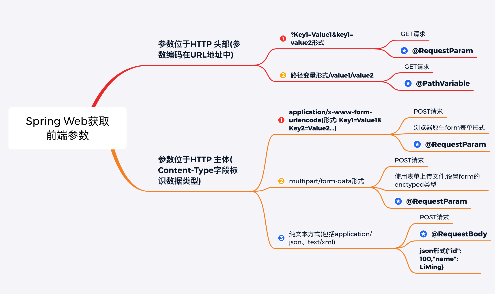
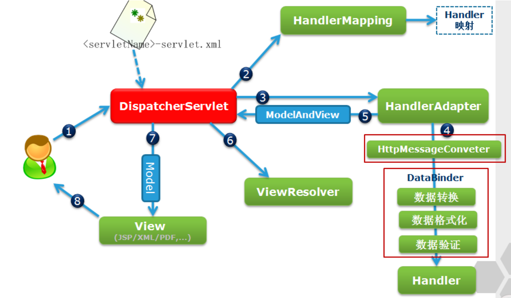
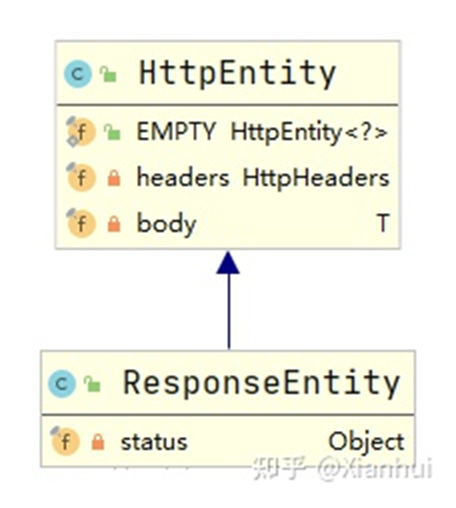
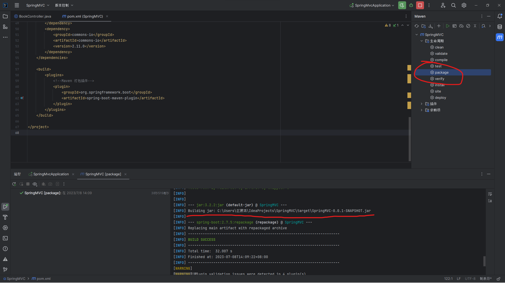
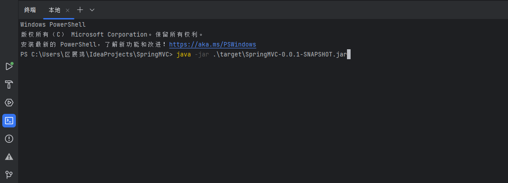
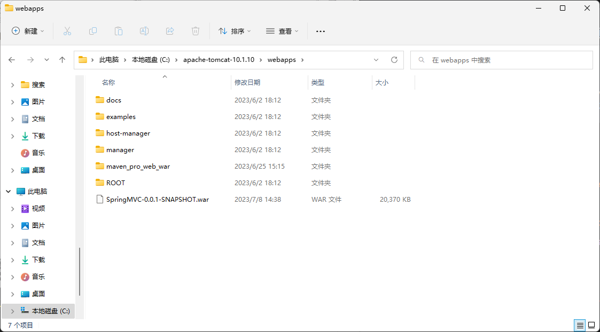

# Spring Boot Web 层

## SpringBoot Web ⼯作流程

---

- 工作流程步骤如下：

  1. ⽤户发送请求到前端控制器(DispatcherServlet)；
  2. 前端控制器请求 HandlerMapping 查找 Handler；(可根据 xml 配置、注解进行查找、在 SpringBoot 中则自动完成)
  3. 处理器映射器 HandlerMapping 向前端控制器返回 Handler；
  4. 端控制器请求处理器适配器去执⾏ Handler；
  5. 处理器适配器去执行 Handler
  6. 处理器适配器执行完成后，Controller 返回 ModelAndView ；(如果包含 ResponseBody 表示返回文本类型)
  7. 处理器适配器向前端控制器返回 ModelAndView，ModelAndView 是 springmvc 框架的⼀个底层对象，包括 Model 和 view；
  8. 前端控制器请求视图解析器去进行视图解析；(根据逻辑视图名解析成真正的视图( jsp ))
  9. 视图解析器向前端控制器返回 View；
  10. 前端控制器进行视图渲染；(视图渲染即. 模型数据(在 ModelAndView 对象中)填充到 request 域)
  11. 前端控制器向用户响应结果

  

## Web层常用注解与核心层

---

- 相关依赖：

    ~~~xml
    <dependency>
        <groupId>org.springframework.boot</groupId>
        <artifactId>spring-boot-starter-web</artifactId>
    </dependency>
    <!-- 数据校验-->
    <dependency>
        <groupId>org.springframework.boot</groupId>
        <artifactId>spring-boot-starter-validation</artifactId>
    </dependency>
    <!-- 视图层依赖-->
    <dependency>
        <groupId>org.springframework.boot</groupId>
        <artifactId>spring-boot-starter-thymeleaf</artifactId>
    </dependency>
    ~~~

### URL地址映射

- 地址映射也成为地址路由，指由url地址映射到控制器 Controller 的过程。在Servlet中，我们是用注解 ***@WebServlet*** 或者 XML 配置文件的方式来实现地址映射。SpringBoot 提供了更为简单和快捷的映射注解。

- ***@RequestMapping*** 是 SpringBoot 提供的⼀个地址映射的基础注解，主要用途是将 Web 请求与请求处理类中的方法进行映射。

  - ***@RequestMapping*** 注解拥有以下的六个配置属性：

    1. value：映射的请求 URL 或者其别名
    2. method：:兼容 HTTP 的方法名

    3. params：根据 HTTP 参数的存在、缺省或值对请求进行过滤
    4. header：根据 HTTP Header 的存在、缺省或值对请求进行过滤
    5. consume：设定在 HTTP 请求正文中允许使⽤的媒体类型
    6. product：在 HTTP 响应体中允许使用的媒体类型

  - 代码演示：

    1. 以下代码将映射了路径 /demo/home，并且指定了 Http 请求方法为 GET 类型。

       ~~~java
       @Controller
       public class DemoController{
       	@RequestMapping(value = "/demo/home", method = RequestMethod.GET)
       	public String home(){
       		return "home";
       	}
       }
       ~~~

       

    2. 上⾯功能以分层的形式表示，如下所示：

       ~~~java
       @Controller
       @RequestMapping(value = "/demo")
       public class DemoController{
       	@RequestMapping(value = "/home", method = RequestMethod.GET)
       	public String home(){
       		return "home";
       	}
       }
       ~~~

       

    3. 映射到多个 URL 地址，如下所示：

       ~~~java
       /*映射到多个URL地址*/
       @GetMapping(value = {"path1", "path2"})
       public String multiUrl() {
       	return "演示映射到多个不同的url地址";
       }
       ~~~

- 在 Spring5 之后，出现了更简单的 Http 请求⽅法映射的注解，分别是：

  | 注解           | 说明                    |
  | -------------- | ----------------------- |
  | @GetMapping    | ⽤于处理HTTP GET请求    |
  | @PostMapping   | ⽤于处理HTTP POST请求   |
  | @PutMapping    | ⽤于处理HTTP PUT请求    |
  | @DeleteMapping | ⽤于处理HTTP DELETE请求 |
  | @PatchMapping  | ⽤于处理HTTP PATCH请求  |

### GET 请求与 POST 请求

1. GET 请求和 POST 请求的区别

   1. GET 请求：
      1. GET 请求可被缓存
      2. GET 请求保留在浏览器历史记录中
      3. GET 请求可被收藏为书签
      4. GET 请求不应在处理敏感数据时使用
      5. GET 请求有长度限制
      6. GET 请求只应当用于取回数据
   2. POST 请求：
      1. POST 请求不会被缓存
      2. POST 请求不会保留在浏览器历史记录中
      3. POST 请求不能被收藏为书签
      4. POST 请求对数据长度没有要求

2. GET 请求和 POST 请求的缓存问题

   ​		缓存的概述：***HTTP 缓存***的基本目的就是使应⽤执⾏的更快，更易扩展，但是 HTTP 缓存通常只适⽤于 idempotent request（可以理解为查询请求，也就是不更新服务端数据的请求），这也就导致了在 HTTP 的世界⾥，<u>⼀般都是对 GET 请求做缓存，POST 请求很少有缓存</u>。

   1. GET 请求多用来直接获取数据，不修改数据，主要目的就是 DB 的 search 语句的感觉。用缓存(有个代理服务器的概念)的目的就是查 db 的速度变快。
   2. POST 请求则是发送数据到服务器端去存储。类似 db 里的 update delete 和 insert 语句的感觉。更新 db 的意思。数据必须放在数据库，所以⼀般都得去访问服务器端。

3. GET 请求和 POST 请求的安全问题

   1. GET 请求参数在 url 中，即传送的数据是在链接里面可看到，有安全问题。
   2. POST 参数不是在 url 里面而是在请求体中，因此安全性较 GET 请求⾼

4. GET 请求的最大长度

   - 各浏览器 HTTP GET 请求 URL 最大长度并不相同，几类常用浏览器最大长度及超过最大长度后提交情况如下：
     1. IE6.0 : URL 最大长度2083个字符，超过最大长度后无法提交。
     2. IE7.0 : URL 最大长度2083个字符，超过最大长度后仍然能提交，但是只能传过去2083个字符。
     3. firefox 3.0.3 : URL 最大长度7764个字符，超过最大长度后无法提交。
     4. Opera 9.52 : URL 最大长度7648个字符，超过最大长度后无法提交。
     5. Google Chrome 2.0.168: URL 最大长度7713个字符，超过最大长度后无法提交。

### 获取 HTTP 报文参数

1. ***@RequestParam***：映射单个参数
   
   - ***@RequestParam*** 用来接受 HTTP 请求参数，即在分发地址之后以？开头的部分。
   
     注：1.***@RequestParam*** 标注在方法形参上，用来获取 HTTP 请求参数值。
   
     ​       2.如果形参为基本类型，可以获取对应的请求参数值。此时需要注意请求参数名是否需要与形参名一致（是否指定 		  value 或 name 属性）。
   
     ​       3.如果形参为 Map <String, String> 或 MultiValueMap <String, String> ，则可以一次性获取全部请求参数。此时请求		  参数名与形参名无关。
   
     ​       4.required 属性默认为 true ，此时必须保证 HTTP 请求中包含与形参一致的请求参数，否则会报错。
   
     ​       5.我们可以使用 defaultValue 属性指定默认值，此时 required 自动指定成 false，表示如果没有提供该请求参数，则		  会使⽤该值。
     
     ​	   6.required=true 表示前端必须传参数。required=false 表示前端不传参数的时候，会将参数置为 null。
   
2. 映射 POJO 对象

   - SpringBoot 还可以将前端提交的表单数据直接映射到实体类。

     注：要求参数的字段名和实体类属性名⼀⼀对应。

3. 获取路径参数

   - 在 Restful API 中，通常使用路径变量来代替之前的？传参的形式。例如：需要获取 id 为1000的图书对象，以往 URL 地址的设计为`http://localhost:8080/book?id=1000`，通过这种形式将 id 值传递到后台。在 restful 标准中，则提倡使用下面的 url 形式：`http://localhost:8080/book/1000`，参数1000则通过路径参数 ***@PathVariable*** 进行传递。

   - SpringBoot 提供了获取路径变量的方法。例如：

     ~~~java
     @GetMapping("/book/{category}/{id}")
     @ResponseBody
     public String findBooks(@PathVariable String category, @PathVariable Long id)
     {
     	return "您需要查询的图书分类(category=" + category + "); 图书Id(id=" + id +
     ").";
     }
     ~~~

     ​		其中在 GetMapping 映射中的大括号包含的为路径变量，例如 /{category}/{id} 表示路径变量为 category 和 id。 在 findBooks 方法中，则使用 ***@PathVariable*** 将路径参数映射到指定变量值。

4. 获取 Http 头部参数

   - ***@RequestHeader*** ：用来获取 HTTP 请求头。
     - 注：请求头本质上也是键值对集合，只相对于请求参数，它们的键都具有固定的名字。
   - 理论上，我们也可以不显式指定 ***@RequestHeader*** 的 value 或 name 属性值，而使⽤对应的形参名。但是由于 HTTP 请求头中⼀般含有 - ，而 Java 不支持此种命名方式，因此推荐还是显式指定 value 或 name 属性值。 另外，我们也可以使用 Map <String, String> 或 MultiValueMap <String, String> 一次性获取所有请求头，此时形参名与请求头参数名没有关系。

5. ***@CookieValue***

   - 我们可以将 Cookie 当做特殊的请求头，它的值是键值对集合，形如 Cookie: cookie1=value1; cookie2 = value2 。但是，⼀般来说我们会使用 ***@CookieValue*** 显式获取 Cookie 键值对集合中的指定值。同样，我们也可以不显式指定 value 或 name 属性值，此时形参名应与需要获取的 cookie 键值对的 key ⼀致

   - 注： 1.@CookieValue 标注在方法形参上，用来获取 HTTP 请求中对应的 cookie 值。

     ​		2.@CookieValue 标注在方法形参上，用来获取 HTTP 请求中对应的 cookie 值。

     ​		3.不能使⽤ Map <String, String> 或 MultiValueMap <String, String> 一次性获取所有 cookies 键值对

6. 获取和设置 session 属性数据

   - 下面代码演示了如何往 session 对象存放属性值，并且取出该属性值。

     ~~~java
     @GetMapping("session")
     public String getSession(HttpSession session) {
     	if (session.getAttribute("username")==null) {
     		session.setAttribute("username", "admin");
     	}
     	String username = (String) session.getAttribute("username");
     	return "当前⽤户为:" + username;
     }
     ~~~

7. 获取 JSON 格式的参数值

   - 在目前移动端开发中，前端传递参数通常使用 JSON 格式进行参数传递，此时 Content-Type 对应的值为 application/json。在 SpringBoot 中，要获取 json 格式的参数值，需要使用 ***@RequestBody*** 的注解。

     1. 由于 JSON 数据只能通过 POST 请求进行传递(数据存放在 Http Body 中)，因此 ***@RequestBody*** 需要和 ***@PostMapping*** 配置使用，此时不能使用 GET 请求。

     2. @RequestBody 可以接收 HTTP 请求体中的数据，但是必须要指定 ***Content-Type*** 请求体的媒体类型为 ***application/json*** ，表示接收  json 类型的数据。

     3. 使用 post 进行测试时，Body 的类型必须选择 ***raw***，数据格式为 json 字符串格式。

   - ⼀般来说在 Controller 方法中仅可声明⼀个 @RequestBody 注解的参数，将请求体中的所有数据转换成对应的 POJO 对象。

   - ***@RequestBody***：标注在方法形参上，用来接收 HTTP 请求体中的 json 数据。

8. ***HttpEntity***

   - 上⾯介绍的注解都只是获取 HTTP 请求中的某个部分，比如 ***@RequestParam*** 获取请求参数、 ***@RequestHeader*** 获取请求头、 ***@CookieValue*** 获取 cookies、 ***@RequestBody*** 获取请求体。

   - Spring 提供了⼀个强大的 HttpEntity 类，它可以同时获取 HTTP 请求的请求头和请求体。

     例如：如下 HTTP 请求：

     ~~~json
     POST http://localhost:8080/student
     Content-Type: application/json
     Cookie: cookie1=value1; cookie2 = value2
     {
     	"name": "Xianhuii",
     	"age": 18
     }
     ~~~

     接受方法如下编写：

     ~~~java
     @RestController
     public class StudentController {
     	@PostMapping("/student")
     	public void handle(HttpEntity<Student> httpEntity) {
     	Student student = httpEntity.getBody();
     	HttpHeaders headers = httpEntity.getHeaders();
     	System.out.println(student); 
             // Student{name='Xianhuii',age=18}
     	System.out.println(headers);
            /** [
              * content-length:"37",
              * host:"localhost:8080",
              * connection:"Keep-Alive",
              * user-agent:"Apache-HttpClient/4.5.12 (Java/11.0.8)",
              * cookie:"cookie1=value1; cookie2 = value2",
              * accept-encoding:"gzip,deflate",
              * Content-Type:"application/json;charset=UTF-8"
              * ]*/
     	}
     }
     ~~~

     

###  处理Http应答

对请求数据处理完成之后，最后⼀步是需要向客户端返回⼀个结果，即发送响应数据。

1. ***@ResponseBody***

   1. ***@ResponseBody*** 可以标注在类或方法上，它的作用是将方法返回值作为 HTTP 响应体发回给客户端，与 ***@ResquestBody*** 刚好相反。
   2. 如果将 ***@ResponseBody*** 标注到***类***上，表示类中所有方法的返回值都会被直接绑定到响应体中，或将其标注到***方法***上，表示仅有方法的返回值会被直接绑定到响应体中。
      - 用法：
        1. ***@ResponseBody*** 表示将方法返回值直接绑定到 web 响应体中。
        2. ***@ResponseBody*** 可以标注到类或方法上。类上表示内部所有方法的返回值都直接绑定到响应体中，方法上表示仅有该方法的返回值直接绑定到响应体中。
        3. ***@ResponseBody*** 标注到类上时，与 ***@Controller*** 相结合可以简写成 ***@RestController*** ，这也是通常使用的注解。
        4. 我们可以灵活地构造合适的返回对象，结合 ***@ResponseBody*** ，用作与实际项目最匹配的响应体返回。

2. ResponseEntity

   ​		ResponseEntity 是 HttpEntity 的子类，它除了拥有父类中的 headers 和 body 成员变量，自己还新增了⼀个 status 成员变量。因此， ResponseEntity 集合了响应体的三个最基本要素：<u>响应头、状态码和响应数据</u>。它的层次结构如下：

   - status 成员变量⼀般使用 HttpStatus 枚举类表示，其中涵盖了几乎所有常用状态码，使用时可以直接翻看源码。

   - ResponseEntity 的基本使用流程如下，注意我们此时没有使用 ***@ResponseBody***（但是推荐直接使用 ***@RestController*** ）：

     ~~~java
     @RestController
     public class StudentController {
     	@GetMapping("/student")
     	public ResponseEntity<Student> handle() {
     	// 创建返回实体:设置状态码、响应头和响应数据
     	return ResponseEntity.ok().header("hName", "hValue").body(new Student("Xianhuii", 18));
     	} 
     }
     ~~~

   - 用法：

     1. ResponseEntity 直接用作方法返回值，表示将其作为HTTP响应：包括状态码、响应头和响应体。
     2. ResponseEntity 中包含 status 、headers 和 body 三个成员变量，共同组成HTTP响应。
     3. ResponseEntity 具有链式的静态方法，可以很方便地构造实例对象。

### 数据校验

- 数据校验的位置

  1. 前端校验：使用 JavaScript 框架完成。
  2. 后端校验：使用 SpringBoot-vaildation 模块完成。

- 数据校验内容：

  1. 参数的合法性
  2. 错误提示信息的处理和现实

- 相关依赖：

  ~~~~~xml
  <!--使用 @Valid 注解需要引入 validation-api、lbernate-validator 依赖-->
  <dependency>
  	<groupId>org.springframework.boot</groupId>
  	<artifactId>spring-boot-starter-validation</artifactId>
  </dependency>
  <!--SpringBoot 在2.3之后需要添加下面依赖-->
  <dependency>
  	<groupId>org.hibernate.validator</groupId>
  	<artifactId>hibernate-validator</artifactId>
  	<version>6.0.17.Final</version>
  	<scope>compile</scope>
  </dependency>
  ~~~~~

数据校验方式：

1. 方法参数合法性校验
   - 实现方法：在控制器类标注 ***@Validated*** 注解
2. POJO 类校验
   - 实现方法：
     1. 在 POJO 类的属性添加对应的校验注解
     2. 在控制器方法中使用 ***@Valid*** 注解表示对参数进行校验，同时后面使用 Errors/BindingResult 来捕获错误信息，并进行处理。

***@Validated*** 和 ***@Valid*** 的区别

- ***@Valid*** 是使用 Hibernate validation 的时候使用
- ***@Validated*** 是只用 Spring Validation 校验机制使用

### 异常处理

1. ***@ExceptionHandler***
   
   - 上面介绍的都是正常返回的情况，在某些特殊情况下程序可能会抛出异常，因此不能正常返回。此时，就可以用 ***@ExceptionHandler*** 来捕获对应的异常，并且统一返回。
   
   - 注： 1.它的形参代表该方法所能捕获的异常，作用与 @ExceptionHandler 的 value 属性相同。
   
     ​		2.它的返回值也十分灵活，既可以指定为上述的 ***@ResponseBody*** 或 ResponseEntity 等绑定到响应体中的值，也可以指定为 Model 等视图相关值。
   
     ​		3.由于当前考虑的是前后端分离场景，因此我们需要指定 ***@ResponseBody*** ，上面代码已经声明了 ***@RestController*** 。
   
     ​		4.***@ResponseStatus*** 不是必须的，我们可以自己构造出合适的响应对象。
   
     ​		5.***@ExceptionHandler*** 只能处理本类中的异常。
   
   - 例子：
   
     1. 自定义一个异常：
   
        ~~~java
        public class NoSuchStudentExcpetion extends RuntimeException{
            public NoSuchStudentExcpetion(String s){
                super(s);
            }
        }
        ~~~
   
     2. 编写Controller方法：
   
        ~~~java
        @GetMapping("/student")
        public ResponseEntity<Student> handle() {
        	throw new NoSuchStudentExcpetion("没有找到该student");
        }
        @ResponseStatus(HttpStatus.NOT_FOUND)
        @ExceptionHandler
        public String exception(NoSuchStudentExcpetion exception){
        	return exception.getMessage();
        }
        ~~~
   
        - 上述代码的流程：
          1. 接收 GET `http://localhost:8080/student` 请求，分发到 handle() 方法。
          2. handle() 方法执行过程中抛出 NoSuchStudentException 异常。
          3. NoSuchStudentException 被相应的 exception() 方法捕获，然后根据 @ResponseStatus 和错误消息返回给客户端。
   
   - 上面代码中我们只针对 NoSuchStudentException 进行处理，如果此类中还有其他异常，则需要另外编写对应的异常处理方法。我们还有一种最佳实践方式，即定义一个统一处理异常，然后在方法中进行细化处理：
   
     ~~~java
     public String exception(Exception exception){
             String message = "";
             if (exception instanceof StudentExcpetion){
                 return message = "没有找到该student";
             }else { }
             return message;
         }
     ~~~
   
2. ***@ControllerAdvice***

   上面介绍的 ***@ExceptionHandler*** 有⼀个很明显的局限性：它只能处理本类中的异常。

   接下来我们来介绍⼀个十分强大的 ***@ControllerAdvice*** 注解，使⽤它与 ***@ExceptionHandler*** 相结合，能够管理整个应⽤中的所有异常。 

   例子：

   1. 我们定义一个统一处理全局异常的类，使⽤ ***@ControllerAdvice*** 标注。并将之前的异常处理方法移到此处（注意此时需要添加 ***@ResponseBody*** ）：

       ~~~java
       @ControllerAdvice
       @ResponseBody
       public class exception{
           @ResponseStatus(HttpStatus.NOT_FOUND)
           @ExceptionHandler
           public String xx(Exception exception){
               String message = "";
               if (exception instanceof NoSuchStudentExcpetion){
                   return message = "没有找到该student";
               }else { }
               return message;
           }
       }
       ~~~

   2. 编写Controller方法：

       ~~~java
       @GetMapping("/student")
       public ResponseEntity<Student> handle() {
       	throw new NoSuchStudentExcpetion("没有找到该student");
       }
       ~~~

       - 上述代码的流程：
         1. 创建Controller类：***@Controller*** 或 ***@RestController*** 注解。
         2. 指定分发地址：***@RequestMapping*** 以及各种 ***@XxxMapping*** 注解。
         3. 接受请求参数：***@PathVariable*** 、 ***@RequestParam*** 、 ***@RequestHeader*** 、 ***@CookieValue*** 、 ***@RequestBody*** 、 HttpEntity 以及 ***@RequestPart*** 和 MultipartFile 。
         4. 发送响应数据： ***@ResponseBody*** 、 ResponseEntity 以及 ***@ExceptionHandler*** 和 ***@ControllerAdvice***。

### DispatcherServlet

​		DispatcherServlet 的全名是 <u>org.springframework.web.servlet.DispatcherServlet</u> ，它在程序中充当着前端控制器的角色。在使用时，只需将其配置在项目的 ***web.xml*** 文件中，其配置代码如下：

~~~xml
<servlet>
	<servlet-name>springmvc</servlet-name>
	<servlet-class>org.springframework.web.servlet.DispatcherServlet</servlet-class>
	<!-- <init-param>
		<param-name>contextConfigLocation</param-name>
		<param-value>classpath:springmvc-servlet.xml</param-value>
	</init-param>  -->
	<load-on-startup>1</load-on-startup>
</servlet>
<servlet-mapping>
	<servlet-name>springmvc</servlet-name>
	<url-pattern>/</url-pattern>
</servlet-mapping>
~~~

### @Controller

​		org.springframework.stereotype.Controller 注解类型用于指示 Spring 类的实例是一个控制器，其注解形式为 ***@Controller***。该注解在使用时不需要再实现 Controller 接口，只需要将 ***@Controller*** 注解加入到控制器类上，然后通过 Spring 的扫描机制找到标注了该注解的控制器即可。

- @Controller 注解在 Controller 的使用示例：

  ~~~java
  @Controller
  public class FirstController {
  	public ModelAndView handleRequest(HttpServletRequest request,HttpServletResponse response)throws Exception{
  	}
  }
  ~~~

- 为了保证 Spring 能够找到控制器类，还需要在 SpringMVC 的配置文件中添加相应的扫描配置信息，一个完整的配置文件示例如下：

  ~~~xml
  <?xml version="1.0" encoding="UTF-8"?>
  <beans xmlns="http://www.springframework.org/schema/beans"
         xmlns:xsi="http://www.w3.org/2001/XMLSchema-instance"
         xmlns:context="http://www.springframework.org/schema/context"
         xsi:schemaLocation="http://www.springframework.org/schema/beans
                             http://www.springframework.org/schema/beans/spring-beans.xsd
                             http://www.springframework.org/schema/context
                             http://www.springframework.org/schema/context/spring-context.xsd">
      <!-- 指定需要扫描的包 -->
      <context:component-scan base-package="com.itheima.Controller" />
  </beans>
  ~~~

  注：使用注解方式时，程序的运行需要依赖 Spring 的 AOP 包，因此需要向 lib 目录中添加 spring-aop-{版本}.RELEASE.jar，否则程序运行时会***报错***。

### @RequestMapping

​		Spring 通过 ***@Controller*** 注解找到相应的控制器类后，还需要知道控制器内部对每一个请求是如何处理的，这就需要使用 ***@RequestMapping*** 注解类型，它用于映射一个请求或一个方法。使用时，可以标注在一个方法或一个类上。

- 标注在方法上：作为请求处理方法在程序接收到对应的URL请求时被调用

- 标注在类上：该类中的所有方法都将映射为相对于类级别的请求，表示该控制器所处理的所有请求都被映射到 value 属性值所知道的路径下。

- ***@RequestMapping***注解除了可以指定 value 属性外，还可以指定其他一些属性，如下表所示：

  | 属性名   | 类型            | 描述                                                         |
  | -------- | --------------- | ------------------------------------------------------------ |
  | name     | String          | 可选属性，用于为映射地址指定别名。                           |
  | value    | String[]        | 可选属性，同时也是默认属性，用于映射一个请求和一种方法，可以标注在一个方法或一个类上 |
  | params   | String[]        | 可选属性，用于指定 Request 中必须包含某些参数的值，才可以通过其标注的方法处理。 |
  | header   | String[]        | 可选属性，用于指定 Request 中必须包含某些指定的 header 的值，才可以通过其标注的方法处理 |
  | consumes | String[]        | 可选属性，用于指定处理请求的提交内容类型 (Content-type)，比如 application/json，text/html 等。 |
  | produces | String[]        | 可选属性，用于指定返回的内容类型，返回的内容类型必须是 request 请求头 (Accept) 中所包含的类型。 |
  | method   | RequestMethod[] | 可选属性，用于指定该方法用于处理哪种类型的请求方式，其请求方式包括：GET、POST、HEAD、OPTIONS、PUT、PATCH、DELETE 和 TRACE。 例如 method = RequestMethod.GET 表示只支持GET请求，如果需要支持多个请求方式则需要通过{}写成数组的形式，并且多个请求方式直接是有英文逗号分隔。 |

### 请求处理方法的参数好返回类型

​		在控制器类中，每一个请求处理方法都可以有多个不同类型的参数，以及一个多种类型的返回结果。在请求处理方法中，可以出现的参数类型如下： 

### ViewResolver(视图解析器)

Spring MVC 中的视图解析器负责解析视图，可以通过在配置文件中定义一个 ViewResolver 来配置视图解析器，其配置示例如下：

~~~xml
<!-- 定义视图解析器 -->
<bean id="viewResolver" class="org.springframework.web.servlet.view.InternalResourceViewResolver">
	<property name="prefix" value="/WEB-INF/jsp/" />
	<property name="suffix" value=".jsp" />
</bean>
~~~

在上述代码中，定义了一个视图解析器，并设置了视图的前缀好后缀属性。这样设置后，方法中所定义的 view 路径将可以简化。例如，入门案例中的逻辑视图名只需设置为“first”，而不再需要设置为“/WEB-INF/jsp/first.jsp”，在访问时视图解析器会自动的增加前缀和后缀。

## Spring MVC的整合支持

----

### Spring MVC自动配置

​		在 Spring Boot 项目中，一旦引入了 Web 依赖启动器 <u>spring-boot-starter-web</u> ，那么Spring Boot 整合 Spring MVC 框架默认实现的一些 xxxAutoConfiguration 自动配置类就会自动生效，几乎可以在无任何额外配置的情况下进行 Web 开发。

Spring Boot 整合 Spring MVC 的自动化配置功能特性：

- 内置了两个视图解析器：ContentNegotiatingViewResolver 和 BeanNameViewResolver；
- 支持静态资源以及 Webjars ；
- 自动注册了转换器和格式化器；
- 支持 Http 消息转换器；
- 自动注册了信息代码解析器；
- 支持静态项目首页 index.html ；
- 支持定制应用图标 favicon.ico ；
- 自动初始化 Web 数据绑定器 ConfigurableWebBindingInitializer 。

### Spring MVC功能拓展实现

1. 注册视图管理器。在项目的软件包下创建一个实现 WebMvcConfigurer 接口的配置类 MyMVCconfig ，用于对MVC框架功能扩展。

   ~~~java
   @Configuration
   public class MyMVCconfig implements WebMvcConfigurer {
       @Override
       public void addViewControllers(ViewControllerRegistry registry){
           registry.addViewController("test").setViewName("login");
           registry.addViewController("/login.html").setViewName("login");
       }
   }
   ~~~

   ​		MyMVCconfig 实现了接口 WebMvcConfigurer 的 addViewControllers(ViewControllerRegistry registry) 方法。在 addViewControllers() 方法内部，使用 ViewControllerRegistry 的 addViewController() 方法分别定义了“test”和"/login.html"的请求控制，并使用 setViewName(“login”) 方法将路径映射为 login.html 页面。

2. 注册自定义拦截器。WebMvcConfigurer 接口提供了许多MVC开发相关方法，例如，添加拦截器方法 addInterceptors() 、添加格式化器方法 addFormatters() 等。接下来，以 WebMvcConfigurer 接口中添加拦截器的方法 addInterceptors() 为例，讲解扩展 Spring Boot 框架的MVC功能。

   ~~~java
   @Component
   public class MyInterceptor implements HandlerInterceptor {
       @Override
       public boolean preHandle(HttpServletRequest request, HttpServletResponse response,Object handler)throws Exception{
           String uri = request.getRequestURI();
           Object loginUser = request.getSession().getAttribute("loginUser");
           if (uri.startsWith("/admin") && null == loginUser){
               response.sendRedirect("test");
           }
           return true;
       }
   
       @Override
       public void postHandle(HttpServletRequest request, HttpServletResponse response, Object handler, ModelAndView modelAndView){
           int i = Calendar.getInstance().get(Calendar.YEAR);
           request.setAttribute("currentYear",i);
       }
   }
   ~~~

   ​		自定义拦截器 MyInterceptor 实现了 HandlerInterceptor 接口。在 preHandle() 方法中编写了一个逻辑控制代码。在用户请求以“/admin”开头的路径时必须先登录，否则重定向到“/test”请求对应的登录页面；在 postHandle() 方法中，向 request 域中存放当前年份 currentYear 用于页面动态展示。

   ​		然后在自定义配置类 MyMVCconfig 中，重写 addInterceptors() 方法注册自定义的拦截器，示例代码如下：

   ~~~java
   @Autowired
   private MyInterceptor myInterceptor;
   @Override
   public void addInterceptors(InterceptorRegistry registry) {
       registry.addInterceptor(myInterceptor).addPathPatterns("/**").excludePathPatterns("login.html");
   }
   ~~~

   ​		上述代码中，先使用 ***@Autowired*** 注解引入自定义的 MyInterceptor 拦截器组件，然后重写其中的 addInterceptors() 方法注册自定义的拦截器。在注册自定义拦截器时，使用 addPathPatterns("/**") 方法拦截所有路径请求，excludePathPatterns("login.html") 方法对“/login.html”路径的请求进行了放行处理。

## Spring Boot 整合 Servlet 三大组件

---

​		最初 Servlet 开发时，通常首先自定义 <u>Servelt、Filter 、Listener</u> 三大组件，然后在文件 web.xml 中进行配置，而 Spring Boot 使用的是内嵌式 Servlet 容器，没有提供外部配置文件 web.xml，因此，Spring Boot 提供了***组件注册***和***路径扫描***两种方式整合 Servlet 三大组件。

### 组件注册整合 Servlet 三大组件

​		在 Spring Boot 中，使用组件注册方式整合内嵌式 Servlet 容器的 Servlet 、Filter 、Listener 三大组件时，只需将这些自定义组件通过 ServletRegistrationBean 、FilterRegistrationBean 、ServletListenerRegistrationBean 类注册到容器中即可，这些类相当于将组件配置在 Web.xml 中。

#### 使用组件组成方式整合 Servlet

1. 创建自定义 Servlet 类，在项目中创建名为 servletComponent 包，并在该包下创建一个自定义 Servlet 类 MyServlet ，内容如下：

   ~~~java
   @Component
   public class MyServlet extends HttpServlet {
       @Override
       protected void doGet(HttpServletRequest req, HttpServletResponse resp) throws ServletException, IOException {
           resp.getWriter().println("Hello MyServlet");
       }
       @Override
       protected void doPost(HttpServletRequest req, HttpServletResponse resp) throws ServletException, IOException {
           doGet(req, resp);
       }
   }
   ~~~

   ​		使用 ***@Component*** 注解将 MyServlet 类作为组件注入 Spring 容器。MyServlet 类自 HttpServlet ，通过 HttpServletResponse 对象向页面输出“Hello MyServlet”。

2. 创建 Servlet 组件配置类。在项目 config 包下创建一个 Servlet 组件配置类 ServletConfig，用来对 Servlet 相关组件进行注册，内容如下：

   ~~~java
   @Configuration
   public class ServletConfig {
       @Bean
       public ServletRegistrationBean getServlet(MyServlet myServlet){
           ServletRegistrationBean<MyServlet> myServletServletRegistrationBean = new ServletRegistrationBean<>(myServlet, "/myServlet");
           return myServletServletRegistrationBean;
       }
   }
   ~~~

   ​		使用 ***@Configuration*** 注解定义了一个 Servlet 组件配置类 ServletConfig ，并添加了一个 getServlet(MyServlet myServlet) 方法，通过组件注册的方式注册自定义的 MyServlet 组件。在注册自定义的 MyServlet 组件时，指定了匹配路径为"/myServlet"，并使用 ***@Bean*** 注解将重新组装的 ServletRegistrationBean 类对象作为 Bean 组件返回。

#### 使用组件组成方式整合 Filter

1. 创建自定义 Filter 类。在 servletComponent 包下创建一个类 MyFilter ，内容如下：

   ~~~java
   @Component
   public class MyFilter implements Filter {
   
       @Override
       public void init(FilterConfig filterConfig) throws ServletException {
           Filter.super.init(filterConfig);
       }
       @Override
       public void doFilter(ServletRequest servletRequest, ServletResponse servletResponse, FilterChain filterChain) throws IOException, ServletException {
           System.out.println("myFilter执行了..");
           filterChain.doFilter(servletRequest,servletResponse);
       }
       @Override
       public void destroy() {
           Filter.super.destroy();
       }
   }
   ~~~

   ​		使用 ***@Component*** 注解将当前 MyFilter 类作为组件注入到 Spring 容器中。MyFilter 类实现 Filter 接口，并重写了 init() 、doFilter() 、和 destory() 方法，在 doFilter() 方法中向控制台打印了“Hello MyFilter”。

2. 向 Servlet 组件配置类注册自定义 Filter 类。打开之前创建的 Servlet 组件配置类 ServletConfig ，该自定义 Fliter 类使用组件注册方式进行注册，如下所示：

   ~~~java
   @Bean
   public FilterRegistrationBean getFilter(MyFilter myFilter){
   	FilterRegistrationBean<MyFilter> myFilterFilterRegistrationBean = new FilterRegistrationBean<>(myFilter);
           myFilterFilterRegistrationBean.setUrlPatterns(Arrays.asList("/test"));
           return myFilterFilterRegistrationBean;
   }
   ~~~

   ​		使用组件注册方式自定义的 MyFilter 类。在 getFilter() 方法中，使用 setUrlPatterns(Arrays.asList("/test")) 方法定义了过滤的请求路径为"/test"，同时使用了 ***@Bean*** 注解将当前组装好的 FilterRegistrationBean 对象作为 Bean 组件返回。

#### 使用组件组成方式整合 Listener

1. 创建自定义 Listener 类。在 servletComponent 包下创建一个类 MyListener ，内容如下：

   ~~~java
   @Component
   public class MyListener implements ServletContextListener {
       @Override
       public void contextInitialized(ServletContextEvent sce) {
           System.out.println("contextInitialized执行了...");
       }
       @Override
       public void contextDestroyed(ServletContextEvent sce) {
           System.out.println("contextDestroyed执行了");
       }
   }
   ~~~

   ​		使用 ***@Component*** 注解将 MyListener 类作为组件注册到 Spring 容器中。Listener 类实现了 ServletContextListener 接口，并重写了 contextInitialized() 和 contextDestroyed() 方法。

   - 注：Servlet 容器提供了许多 Listener 接口，例如 ServletContextListener 、ServletRequestListener 、HttpSessionLintener 等，在自定义 Listener 类时要根据自身需求选择实现这些接口。

2. 向 Servlet 组件配置类注册自定义 Listener 类。打开之前创建的 Servlet 组件配置类 ServletConfig 将该自定义 Listener 类使用组件注册方式进行注册，内容如下：

   ~~~java
   @Bean
   public ServletListenerRegistrationBean getListener(MyListener myListener){
           ServletListenerRegistrationBean<MyListener> myListenerServletListenerRegistrationBean = new ServletListenerRegistrationBean<>(myListener);
           return myListenerServletListenerRegistrationBean;
   }
   ~~~

   ​		使用组件注册方式注册了一个自定义的 MyListener 类，在 getListener() 方法中，使用了 ***@Bean*** 注解将当前组装好的 ServletListenerRegistrationBean 对象作为 Bean 组件返回。

### 路径扫描整合 Servlet 三大组件

​		在 Spring Boot 中，使用组件注册方式整合内嵌式 Servlet 容器的 Servlet 、Filter 、Listener 三大组件时，首先需要在自定义组件上分别添加 ***@WebServlet*** 、***@WebServlet*** 和 ***@WebListener*** 注解进行声明，并配置相关注解属性，然后在项目主程序启动类上使用 ***@ServletComponentScan*** 注解开启组件扫描即可。

1. Servlet

   ~~~java
   @WebServlet("/myServlet")
   public class MyServlet extends HttpServlet {
       @Override
       protected void doGet(HttpServletRequest req, HttpServletResponse resp) throws ServletException, IOException {
           resp.getWriter().println("hello MyServlet");
       }
       @Override
       protected void doPost(HttpServletRequest req, HttpServletResponse resp) throws ServletException, IOException {
           doGet(req, resp);
       }
   }
   ~~~

2. Filter

   ~~~java
   @WebFilter(value = {"/test1","/test2"})
   public class MyFilter implements Filter {
       @Override
       public void init(FilterConfig filterConfig) throws ServletException {
           Filter.super.init(filterConfig);
       }
       @Override
       public void doFilter(ServletRequest servletRequest, ServletResponse servletResponse, FilterChain filterChain) throws IOException, ServletException {
           System.out.println("myFilter执行了..");
           filterChain.doFilter(servletRequest,servletResponse);
       }
       @Override
       public void destroy() {
           Filter.super.destroy();
       }
   }
   ~~~

3. Listener

   ~~~java
   @WebListener
   public class MyListener implements ServletContextListener {
       @Override
       public void contextInitialized(ServletContextEvent sce) {
           System.out.println("contextInitialized执行了...");
       }
       @Override
       public void contextDestroyed(ServletContextEvent sce) {
           System.out.println("contextDestroyed执行了");
       }
   }
   ~~~

4. 在项目主程序启动类

   ~~~java
   @ServletComponentScan
   @SpringBootApplication
   public class SpringMvcApplication {
   	public static void main(String[] args) {
   		SpringApplication.run(SpringMvcApplication.class, args);
   	}
   }
   ~~~

## 文件上传与下载

---

### 文件上传

​		开发 Web 应用时，文件上传是很常见的一个需求。浏览器通过表单形式将文件以流的形式传递给服务器，服务器对上传的数据解析处理。

1. 编写文件上传的表单页面

   ​		在项目根路径下的 templates 模版引擎文件夹下创建一个用来上传文件的 upload.html 模版页面，内容如下：

   ~~~html
   <!DOCTYPE html>
   <html lang="en" xmlns:th="http://www.thymeleaf.org">
   <head>
       <meta charset="UTF-8">
       <meta http-equiv="Content-Type" content="text/html"; charset="UTF-8">
       <title>动态添加文件上传列表</title>
       <link th:href="@{/login/css/bootstrap.min.css}" rel="stylesheet">
       
   </head>
   <body>
       
上传成功！！！

       <form th:action="@{/uploadFile}" method="post" enctype="multipart/form-data">
           上传文件:&nbsp;&nbsp;<input type="button" value="添加文件" onclick="add()"/>
           

           <input id="submit" type="submit" value="上传" style="display: none;margin-top: 10px;"/>
       </form>
       
   </body>
   </html>
   ~~~

2. 在全局配置文件中添加文件上传的相关配置

   ​		在全局配置文件 application.properties 中添加文件上次功能的相关设置，内容如下：

   ~~~properties
   #单个上传文件大小限制(默认为1MB)
   spring.servlet.multipart.max-file-size=10MB
   #总上传文件大小限制(默认为10MB)
   spring.servlet.multipart.max-request-size=50MB
   ~~~

3. 进行文件上传处理实现文件上传功能

   ​		在 controller 包下创建一个管理文件上传下载的控制类 FileController ，用于实现文件上传功能，内容如下：

   ~~~java
   @Controller
   public class FileController {
       @GetMapping("/toUpload")
       public String toUpload(){
           return "upload";
       }
       @PostMapping("/uploadFile")
       public String uploadFile(MultipartFile[] fileUpload, Model model){
           model.addAttribute("uploadStatus","上传成功");  //返回上传成功的状态信息
           for (MultipartFile file : fileUpload) { //上传文件逻辑开始
               String originalFilename = file.getOriginalFilename();   //获取上传文件的名称及后缀名
               String filename = UUID.randomUUID()+"-"+originalFilename;   //重新获取生成文件名
               String dirPath = "D:/file/";    //设置存储目录
               File file1 = new File(dirPath);
               if (!file1.exists()){     //如果文件不存在，自动新建文件夹
                   file1.mkdir();
               }
               try {
                   file.transferTo(new File((dirPath)));
               } catch (IOException e) {
                   e.printStackTrace();
                   model.addAttribute("uploadStatus","上传失败");
               }
           }
           return "upload";
       }
   }
   ~~~

### 文件下载

​		下载文件能够通过 IO 流实现，所以多数框架并没有对文件下载进行封装处理。文件下载时设计到不同浏览器的解析处理，可能会出现中文乱码的情况。

1. 英文名文件下载

   1. 添加文件下载工具依赖。在 pom.xml 文件中这引入文件下载的一个工具类依赖 commons-io ，示例代码如下：

      ~~~xml
      <dependency>
      	<groupId>commons-io</groupId>
      	<artifactId>commons-io</artifactId>
      	<version>2.11.0</version>
      </dependency>
      ~~~

   2. 定制文件下载页面。在项目类路径下的 templates 文件夹下创建一个演示下载的download.html 模版页面，内容如下：

      ~~~xml
      <!DOCTYPE html>
      <html lang="en" xmlns:th="http://www.thymeleaf.org">
      <head>
          <meta charset="UTF-8">
          <title>文件下载</title>
      </head>
      <body>
          
文件下载列表

          <table>
              <tr>
                  <td>bloglogo.jpg</td>
                  <td><a th:href="@{/download(filename='bloglogo.txt')}">下载文件</a> </td>
              </tr>
              <tr>
                  <td>Spring Boot 应用级开发教程.pdf</td>
                  <td><a th:href="@{/download(filename='Spring Boot 应用级开发教程.txt')}">下载文件</a> </td>
              </tr>
          </table>
      </body>
      </html>
      ~~~
   
   3. 编写文件下载处理方法。在之前创建的文件管理控制类 FileController 中编写文件下载的处理方法，示例代码如下：
   
      ~~~java
      @GetMapping("/toDownload")
      public String toDownload(){
          return "download";
      }
      @GetMapping("/download")
      public ResponseEntity<byte[]> fileDownload(String filename){
          String dirPath = "D:/file/"; //指定要下载的文件路径
          File file = new File(dirPath + File.separator + filename);  //创建文件对象
          //如若有中文名的文件还需对 filename 进行修改，引用下面代码filename = getFilename(request,filename);
          HttpHeaders httpHeaders = new HttpHeaders();    //设置响应头
          httpHeaders.setContentDispositionFormData("attachment",filename);   //通知浏览器以下载的形式打开
          httpHeaders.setContentType(MediaType.APPLICATION_OCTET_STREAM); //定义以流的形式下载返回文件数据
          try {
              return new ResponseEntity<>(FileUtils.readFileToByteArray(file),httpHeaders, HttpStatus.OK);
          } catch (IOException e) {
              e.printStackTrace();
              return new ResponseEntity<>(e.getMessage().getBytes(),HttpStatus.EXPECTATION_FAILED);
          }
      }
      ~~~
   
      注：因为不同浏览器的编码不同，因此带中文名的文件下载还需添加代码统一修改编码，示例代码如下：
   
      ~~~java
      private String getFilename(HttpServletRequest request,String filename)throws Exception{
              //根据浏览器的不同进行编码设置，返回编码后的文件名
              String[] IEBrowserKeyWords = {"MSIE", "Trident", "Edge"};   //IE不同版本User-Agent中出现的关键词
              String userAgent = request.getHeader("User-Agent"); //获取请求头代理信息
              for (String keyWord : IEBrowserKeyWords) {
                  if (userAgent.contains(keyWord)){   //IE内核浏览器，统一为UTF-8编码显示，并对转换的+进行更正
                      return URLEncoder.encode(filename,"UTF-8").replace("+","");
                  }
              }
              return new String(filename.getBytes("UTF-8"),"ISO-8859-1"); //火狐等其他浏览器统一为ISO-8859-1编码显示
          }
      ~~~
   

## 打包部署

---

### Jar包方式打包部署

​		由于 Spring Boot 应用中已经嵌入了 Tomcat 服务器，所以将 Spring Boot 应用以默认 Jar 包形式进行打包部署非常简单和方便。

1. 添加 Maven 打包插件。在对 Spring Boot 项目进行打包(包括 Jar 包和 War 包)前，需要在项目 pom.xml 文件中加入 Maven 打包插件，Spring Boot 为项目打包提供了整合后的 Maven 打包插件 spring.boot.maven.plugin ，可以直接使用，示例代码如下：

   ~~~xml
   <!--Maven 打包插件-->
   <plugin>
   	<groupId>org.springframework.boot</groupId>
   	<artifactId>spring-boot-maven-plugin</artifactId>
   </plugin>
   ~~~

2. 使用 IDEA 开发工具进行打包。IDEA 开发工具，除了提供 Java 开发便利之外，还提供好的项目打包支持。

   

3. Jar方式部署

   

### War包方式打包部署

​		虽然通过 Spring Boot 内嵌的 Tomcat 可以直接将项目打成 Jar 包进行部署，但有时候还需要通过外部的可配置 Tomcat 进行项目管理，这就需要将项目打成 War 包。

1. 声明打包方式为 War 包。打开项目的 pom.xml 文件，使用\<packaging>标签将 Spring Boot 项目默认的 Jar 包打包方式修改为 War 形式，示例代码如下：

   ~~~xml
   <!--将项目打包方式声明为 war-->
   <packaging>war</packaging>
   ~~~

2. 声明使用外部 Tomcat 服务器。Spring Boot 为项目默认提供了内嵌的 Tomcat 服务器，为了将项目以 War 形式进行打包部署，还需要声明使用外部 Tomcat 服务器。打开项目的 pom.xml 文件，在依赖文件中将 Tomcat 声明为外部提供，示例代码如下：

   ~~~xml
   <!--声明使用外部提供的 Tomcat-->
   <dependency>
   	<groupId>org.springframework.boot</groupId>
   	<artifactId>spring-boot-starter-tomcat</artifactId>
   	<scope>provided</scope>
   </dependency>
   ~~~

3. 提供 Spring Boot 启动的 Servlet 初始化器。将 Spring Boot 项目生产可部署 War 包的最后一步也是最重要的一步就是提供 SpringBootServletInitializer 子类并覆盖其 configure() 方法，这样做是利用了 Spring 框架的 Servlet 3.0 支持，允许应用程序在 Servelt 容器启动时可以进行配置。打开项目的主程序启动类，让其继承 SpringBootServletInitializer 并实现 configure() 方法，示例代码如下：

   ~~~java
   @SpringBootApplication
   public class SpringMvcApplication extends SpringBootServletInitializer {
   	@Override
   	protected SpringApplicationBuilder configure(SpringApplicationBuilder builder) {
   		return builder.sources(SpringMvcApplication.class);
   	}
   	public static void main(String[] args) {
   		SpringApplication.run(SpringMvcApplication.class, args);
   	}
   }
   ~~~

4. War 包方式部署

   1. 将生成的 War 包复制到外部的 Tomcat 文件的 webapps 文件夹下(你自己的Tomcat)

      

   2. 然后到外部的 Tomcat 文件的 bin 文件夹下双击 startup.bat 启动Tomcat
