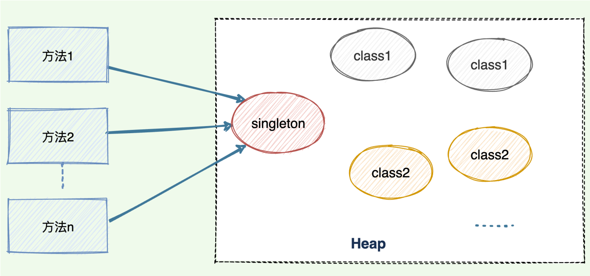
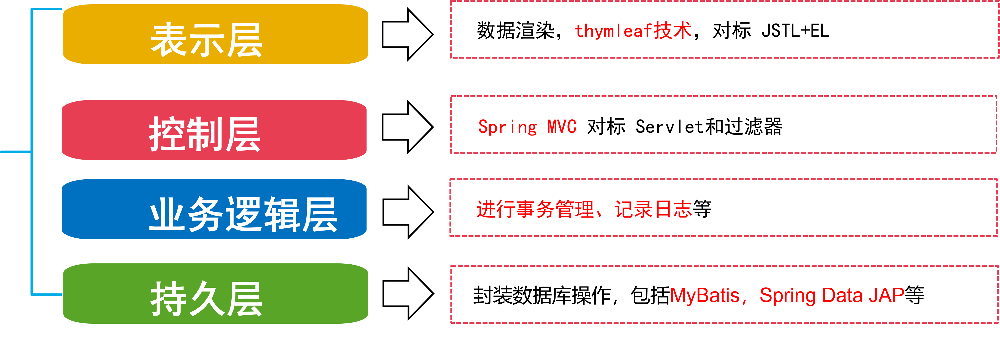
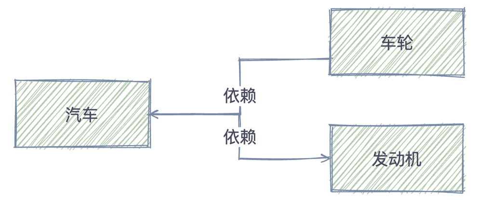
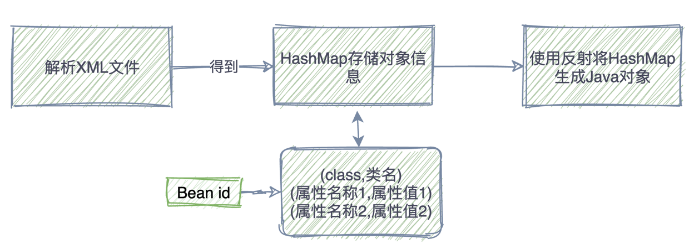
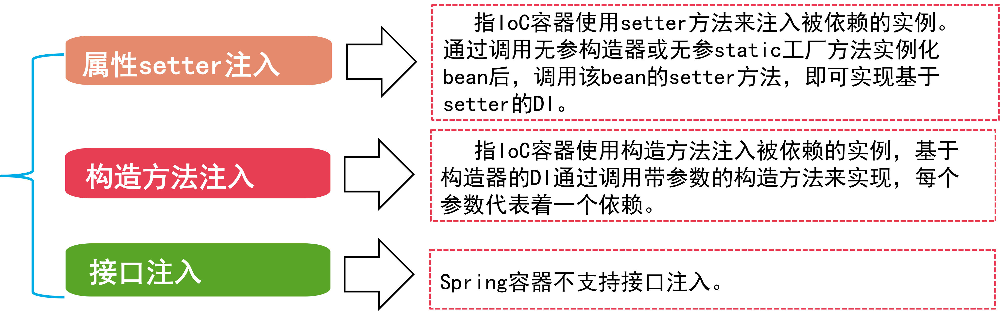

# Spring框架

## 正射与反射

---

### 正射与反射的概述

- 正射：正射就是在运行时就知道要操作的类是什么，并且可以使用new关键字来创建对象。
- 反射：反射就是在运行时才知道要操作的类是什么，并且可以在运行时获取类的完整构造，并调用对应的方法。
  - 优点：
    1. 在程序运⾏过程中可以操作类对象，增加了程序的灵活性。
    2. 解耦，从⽽提⾼程序的可扩展性，提⾼代码的复⽤率，⽅便外部调⽤。
    3. 对于任何⼀个类，当知道它的类名后，就能够知道这个类的所有属性和⽅法；⽽对于任何⼀个对象，都能够调⽤它的⼀个任意⽅法。
  - 缺点：
    1. 性能问题：Java 反射中包含了⼀些动态类型，JVM ⽆法对这些动态代码进⾏优化，因此通过反射来操作的⽅式要⽐正常操作效率更低。
    2. 安全问题：使⽤反射时要求程序必须在⼀个没有安全限制的环境中运⾏，如果程序有安全限制，就不能使⽤反射。
    3. 程序健壮性：反射允许代码执⾏⼀些平常不被允许的操作，破坏了程序结构的抽象性，导致平台发⽣变化时抽象的逻辑结构⽆法被识别。

### 正射与反射创建对象的方法

1. 正射：

   ~~~java
   Apple apple = new Apple();    //调用默认构造函数直接初始化对象
   apple.setPrice(4);
   ~~~

2. 反射：

   ~~~java
   Class clz  = Class.forName("com.javaee.reflect.Apple");
   Constructor constructor = clz.getConstructor();		//获取构造函数
   Object object = constructor.newInstance();		//创建一个对象
   Method method = clz.getMethod("setPrice", int.class);		//获取对象的方法
   method.invoke(object, 4);		//调用方法并传入函数
   ~~~

   上面两段代码的执行结果是完全一样的，但其思路完全不一样，第一段代码在未运行时就已经确定了要运行的类(Apple)，而第二段代码则是在运行时通过字符串值才得知要运行的类(com.javaee.reflect.Apple)。

### 反射常用的API

1. 获取反射中的Class对象

   1. ***Class.forName()*** 静态方法：当你知道该类的全路径名时，你可以使用该方法获取*Class*类对象

      ~~~java
      Class clz  = Class.forName("com.javaee.reflect.Apple");
      ~~~

   2. 使用.class方法

      ~~~java
      Class clz  = Apple.class;
      ~~~

   3. 使用类对象的 ***getClass()*** 方法

      ~~~java
      Apple apple = new String("红富士");
      Class clz = apple.getClass();
      ~~~

2. 通过反射创建类对象

   1. 通过 *Class* 对象的 ***newInstance()*** 方法

      ~~~java
      Class clz  = Apple.class;
      Apple apple = (Apple) clz.newInstance();
      ~~~

   2. 通过 *Constructor* 对象的 ***newInstance()*** 方法

      ~~~java
      Class clz = Apple.class;
      Constructor constructor = clz.getConstructor();
      Apple apple = (Apple)constructor.newInstance();
      ~~~

   通过 *Constructor* 对象创建类对象可以选择特点构造方法，而通过 Class 对象则只能使用默认的无参数构造方法。以下为例子

   ~~~java
   Class clz = Apple.class;
   Constructor constructor = clz.getConstructor(String.class, int.class);
   Apple apple = (Apple)constructor.newInstance("红富士",15);
   ~~~

3. 通过反射获取类属性方法及构造器

   1. 通过 *Class* 对象的 ***getFields()*** 方法：可以获取 Class 类的属性，但无法获取私有属性。

      ~~~java
      Class clz = Apple.class;
      Field[] fields = clz.getFields();
      for (Field field : fields){
      	System.out.println(field.getName());
      }
      //输出结果为 price
      ~~~

   2. 通过 *Class* 对象的 ***getDeclaredFields()*** 方法：可以获取包括私有属性在内的所有属性。

      ~~~java
      Class clz = Apple.class;
      Field[] fields = clz.getDeclaredFields();
      for (Field field : fields){
      	System.out.println(field.getName());
      }
      //输出结果为 name price 
      ~~~

   与获取类属性一样，当我们去获取类方法、类构造器时，如果要获取私有方法或私有构造器，则必须使用有 ***<u>declared</u>*** 关键字的方法。

## 单例模式

---

### 单例模式的概述

- ***单例模式是指在内存中只会创建且仅创建⼀次对象的设计模式***。在程序中***多次使⽤同⼀个对象且作⽤相同***时，为了防⽌频繁地创建对象使得内存飙升，单例模式可以让程序仅在内存中***创建⼀个对象***，让所有需要调⽤的地⽅都共享 这⼀单例对象。

  

- 如何保证对象的唯一性
  1. 不允许其他程序⽤ new ⽅法创建对象 ***(构造函数私有化)***。
  2. 在该类中创建对象—在类内部代码中实现对象创建。
  3. 对外提供⼀个可以让其他程序获取该对象的⽅法 ***(提供⼀个静态方法的接口给外部调用)***。

### 单例模式的实现方法

#### 懒汉式：

~~~java
public class BasicSingleton {
      /*使用静态变量*/
      private static BasicSingleton instance = null;
 
      /*构造函数私有化,禁止使用new 创建对象*/
      private BasicSingleton(){}
 
      /*提供静态的获取实例的接口 */
      public static BasicSingleton getInstance(){
          if(instance ==null){      // 这里线程是不安全的,可能得到两个不同的实例
             instance = new BasicSingleton();
          }
          return instance;
      }
      /*测试方法*/
      public static void main(String[]  args){
          BasicSingleton instance1 = BasicSingleton.getInstance();
          BasicSingleton instance2 = BasicSingleton.getInstance();
          System.out.println("懒汉式：instance1和instance2是否相等:" + (instance1 == instance2));
      }
 }
~~~

- 上述代码的缺点：

  如果两个线程同时判断 singleton 为空，那么它们都会去实例化⼀个 Singleton 对象，这就变成双例了，要解决的是***线程安全***问题。

  - 解决方法：

    ~~~java
    public static BasicSingleton getInstance() {
             if (instance == null) {		// 线程A和线程B同时看到singleton = null，如果不为null，则直接返回singleton
             	synchronized(BasicSingleton.class) {		// 线程A或线程B获得该锁进⾏初始化
                             if (instance == null) {		// 其中⼀个线程进⼊该分⽀，另外⼀个线程则不会进⼊该分⽀
                                     instance = new BasicSingleton();
    			}
                     }
    	}
    	return instance;
    }
    ~~~

    上⾯的代码已经完美地解决了***并发安全+性能低效*** 问题：

    1. 第2行代码，如果 singleton 不为空，则直接返回对象，不需要获取锁；而如果多个线程发现 singleton 为空， 则进⼊分⽀。
    2. 第3行代码，多个线程尝试争抢同⼀个锁，只有⼀个线程争抢成功，第⼀个获取到锁的线程会再次判断 singleton 是否为空，因为 singleton 有可能已经被之前的线程实例化。
    3. 其它之后获取到锁的线程在执行到第4行校验代码，发现 singleton 已经不为空了，则不会再 new 一个对象，直接返回对象即可
    4. 之后所有进⼊该方法的线程都不会去获取锁，在第⼀次判断 singleton 对象时已经不为空了

    因为需要两次判空，且对类对象加锁，该懒汉式写法也被称为：***Double Check（双重校验） + Lock（加锁）***

    ---

    但还有一个问题：***指令重排***

    - 指令重排序是指：JVM在保证最终结果正确的情况下，可以不按照程序编码的顺序执⾏语句，尽可能提⾼程序的性能。

    - 解决方法：使⽤<u>***volatile***</u>关键字修饰的变量，可以保证其指令执⾏的顺序与程序指明的顺序⼀致，不会发⽣顺序变换，这样在多线程环境下就不会发⽣NPE异常，如下列代码：

      ~~~java
      private static volatile BasicSingleton instance = null;
      ~~~

#### 饿汉式：

~~~java
 public class HungrySingleton {
	private HungrySingleton(){}
          //1.单例模式的饿汉式[可用]
	private static HungrySingleton instance = new HungrySingleton();

	///提供静态的获取实例的接口 
	public static HungrySingleton getInstance(){
		return instance;
	}

	//测试方法
	public static void main(String[] args){
		HungrySingleton instance1 = HungrySingleton.getInstance();
		HungrySingleton instance2 = HungrySingleton.getInstance();
		System.out.println("饿汉式：instance1和instance2是否相等:"+(instance1 == instance2));
	}
 }
~~~

- 优点：从它的实现中我们可以看到，这种⽅式的实现⽐较简单，在类加载的时候就完成了实例化，避免了线程的同步问题。
- 缺点：由于在类加载的时候就实例化了，所以没有达到 ***Lazy Loading(懒加载)*** 的效果，也就是说可能我没有⽤到这个实例，但是它也会加载，会造成内存的浪费(但是这个浪费可以忽略，所以这种⽅式也是推荐使⽤的)。

### 单例模式的总结

1. 单例模式有两种：懒汉式、饿汉式
2. 懒汉式：在需要⽤到对象时才实例化对象，正确的实现⽅式是：***Double Check + Lock***，解决了并发安全和性能低下问题。
3. 饿汉式：在类加载时已经创建好该单例对象，在获取单例对象时直接返回对象即可，不会存在并发安全和性能问题。
4. 在开发中如果对*内存要求非常高*，那么使⽤懒汉式写法，可以在特定时候才创建该对象。
5. 如果对内存要求不⾼使⽤饿汉式写法，因为简单不易出错，且没有任何并发安全和性能问题。
6. 为了防⽌多线程环境下，因为指令重排序导致变量报 NPE，***需要在单例对象上添加<u>volatile</u>关键字防⽌指令重排序***。

## Spring 框架

---

### Spring 的概述

​		***Spring***是分层的***JavaSE/EE full-stack*** 轻量级开源框架，以 ***IoC（Inverse of Control 控制反转）*** 和 ***AOP（Aspect Oriented Programming 面向切面编程）***为内核，使用基本的 JavaBean 来完成以前只可能由 EJB 完成的工作，取代了 ***EJB*** 的臃肿、低效的开发模式。

### Spring 的框架

​			在实际开发中，通常服务器端在采用三层体系架构，分别为***表示层(web)***、***控制层（Control）***、***业务逻辑层(service)***、***持久层(dao)***， Spring 对每一层都提供了技术支持。

### 控制反转(Inverse Of Control)和依赖注入(DI）

- 控制反转（ Inverse Of Control ）:**对象的创建交给外部容器完成**。不直接在代码中创建对象。控制反转解决对象的管理（创建、销毁等）问题。

- 依赖注入（dependency injection）:**实现对象之间的依赖关系。** 在创建完对象之后，对象之间的关系处理就是依赖注入。

  

注意：Spring 提供了 IOC 容器。无论创建对象、处理对象之间的依赖关系、对象创建的时间还是数量，都在 ***Spring IOC 容器***配置完成。

#### 控制反转(Inverse Of Control)

- IOC 核心思想：资源不由资源的使用方管理，而由不使用资源的第三方管理。

  优点：

  1. 资源集中管理，实现资源的可配置和易管理；
  2. 降低使用资源双方的依赖程度。

- IOC 实现原理：

  1. Java 反射技术。
  2. 解析 XML 文件。
  3. 单例设计模式或工厂设计模式。

- IOC 工作过程

  

### Bean

#### Bean 的概述：

​		如果把 Spring 看做一个大型的工厂，而 Spring 容器中的 Bean 就是该工厂的产品。要想使用这个工厂生产和管理 Bean，就需要在配置文件中告诉它需要哪些 Bean，以及需要使用何种方式将这些 Bean 装配到一起。

#### Bean的三种装配方式

1. ***基于 XML 装配 Bean*** -- 容易理解，但是使用繁琐
2. ***基于自动扫描和注解装配 Bean*** -- 减少XML文件配置
3. ***基于 JavaConfig 装配 Bean*** -- 实现零配置，不需要XML文件

Spring 容器支持两种格式的配置文件：***Properties 文件***、***XML 文件***

下图为 Bean 在 XML 文件下的配置文件：

~~~xml
<beans xmlns="http://www.springframework.org/schema/beans"
       xmlns:xsi="http://www.w3.org/2001/XMLSchema-instance"
       xsi:schemaLocation="http://www.springframework.org/schema/beans 
       	http://www.springframework.org/schema/beans/spring-beans.xsd">
	<!—使用id属性定义bean1,其对应的实现类为cn.itcast.bean1 -->
	<bean id="bean1" class="cn.itcast.bean1"/>
	<!—使用name属性定义bean2,其对应的实现类为cn.itcast.bean2 -->
	<bean name="bean2" class="cn.itcast.bean2"/>
	<!—注意如果在Bean中未指定id和name，则Spring会将class值当作id使用。 -->
</beans>
~~~

在实际开发中，***最常使用的是 XML 文件格式***的配置方式，这种配置方式是通过 XML 文件来注册并管理 Bean 之间的依赖关系。

#### Bean 的实例化

​		在面向对象的程序中，要想使用某个对象，就需要先实例化这个对象。在 Spring 中，***实例化 Bean***有三种方式，分别为***构造器***实例化、***静态工厂方式***实例化和***实例工厂方式***实例化，接下来对这三种方式分别进行讲解。

#### Bean 的作用域

​		Singleton 作用域：Singleton 作用域是 Spring 容器默认的作用域，当一个 bean 的作用域为 singleton 时，Spring 容器中只会存在一个共享的 Bean 实例，并且所有对 bean 的请求，只要 id 与该 bean 定义相匹配的，就只会返回 Bean 的同一个实例。

- 注意：在 Spring 配置文件中，可以使用 bean 元素的 scope 属性，将 Bean 的作用域定义成 singleton。

  ~~~xml
  <bean id="hello" class="cn.itcast.hello.Hello" scope="singleton"/>
  ~~~

#### Bean的装配方式

- ***Bean 的装配***可以理解为依赖关系注入，***Bean 的装配方式即 Bean 依赖注入的方式***。Spring 容器支持多种形式的 Bean 的装配方式，如基于 XML 的装配、基于 Annotation 的装配和自动装配等。

  1. 基于 XML 的装配

     - Spring 依赖注入有两种方式：1.***设值注入(Setter Injection)*** 2.***构造注入(Constructor Injection)***

       1. 设值注入(Setter Injection):

          设值注入要求一个 Bean 必须满足以下两点要求：

          1. Bean 类必须提供一个默认的构造方法。
          2. Bean 类必须为需要注入的属性提供对应的set方法。

          使用设值注入时，在 Spring 配置文件中，需要使用 ***\<bean>*** 元素的子元素 ***\<property>*** 元素来为每个属性注入值。

       2. 构造注入(Constructor Injection):

          使用构造注入时，在配置文件里，主要是使用 ***\<constructor-arg>*** 标签来定义构造方法的参数，可以使用其 ***value*** 属性（或 ***子元素*** ）来设置该参数的值。

  2. 基于 Annotation 的装配

     - 概述：在 Spring 中，尽管使用XML配置文件可以实现 Bean 的装配工作，但如果应用中有很多 Bean 时，会导致XML配置文件过于臃肿，给后续的维护和升级工作带来一定的困难。为此，Java 从 ***JDK1.5*** 以后，提供了 ***Annotation（注解）***功能，Spring 也提供了对 Annotation 技术的***全面支持***。

     - 注解的工作原理

       1. 注解的格式：

          ~~~java
          public @interface 注解名称{ 
          	属性列表; 
          }
          ~~~

       2. 注解分类： ***自定义注解***、***JDK 内置注解***、***第三方框架提供的注解***。

       3. 使用位置： 类、方法、成员变量、型参位置等。

       4. 作用：注释事写给程序员看的，注解是写给程序看的。**目的是为当前读取注解的程序提供判断依据。**

       5. 自定义注释

          例如：

          ~~~java
          @Target({ElementType.FIELD, ElementType.METHOD})
          @Retention(RetentionPolicy.RUNTIME)
          // 定义注解Properly
          public @interface MyProperty{ 
          	Public String value() default "小白"; 
          }
          ~~~

          1. 注解类型是通过“***@interface***”关键字定义。
          2. 注解返回值类型：原始数据类型、String、Class 类型、枚举类型等，可以指定默认返回值。
          3. 注解的使用：***定义注解***、***使用注解***、***读取注解***。
          4. 上面注解表示：***@Target***表示注解使用的地方为属性或者方法；***@Rentention***表示注解在运行时被解析；同时，该注解包含一个名称为 value 的属性，类型为 String，存在默认值。

       6. 注解的解析

          1. 编译时解析。 使用 ***@Rentention*** 的值为 CLASS 的注解，要解析该类注解，需要完成两个步骤：

             1. 自定义一个派生自 AbstractProccessor 的注解处理类。
             2. 重写 process 函数。

          2. 运行时注解解析。指 ***@Rentention*** 的值为 RUNTIME 的注解。通过反射机制在运行时解析定义的注解。

             ~~~java
             T getAnnotation(Class annotationClass) //返回该程序元素的指定类型的注解
             ~~~

       7. Spring常用注解

          | 注解名         | 作用                                                         |
          | -------------- | ------------------------------------------------------------ |
          | @Component     | 装配一个Bean对象，用在相应类上。                             |
          | @Autowired     | 属性注入，将Bean对象注入到另一个对象的属性。                 |
          | @Repository    | 用于将数据访问层 (DAO 层 ) 的类标识为Spring中的Bean，其功能与 @Component 相同。 |
          | @Service       | 通常作用在业务层（Service层），用于将业务层的类标识为Spring中的Bean，其功能与 @Component 相同。 |
          | @Controller    | 通常作用在控制层（如Struts2的Action），用于将控制层的类标识为Spring中的Bean，其功能与 @Component 相同。 |
          | @Autowired     | 用于对Bean的属性变量、属性的Set方法及构造函数进行标注，配合对应的注解处理器完成Bean的自动配置工作。默认按照Bean的类型进行装配。 |
          | @ComponentScan | 定义扫描的路径。                                             |
          | @Configuration | 注解标注当前类为配置类，该类作为Spring的XML配置文件\<beans>  |
          | @Bean          | 用在方法上，将返回值装配为Bean对象。                         |
          | @Qualifier     | 用于消除自动装配Bean时的歧义。当多个类型相同的 Bean 可以注入到目标 Bean 中时，可以使用 @Qualifier 注解指定要注入的Bean |
          
          

### 依赖注入(DI)

依赖注入存在三种实现方式，分别是 ***setter 方法注入***、***构造方法注入***和***接口注入***。

