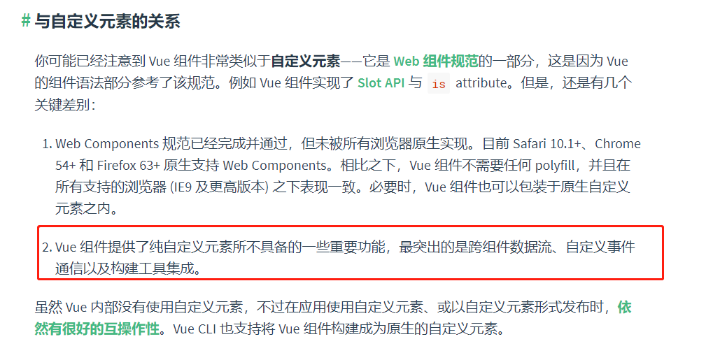
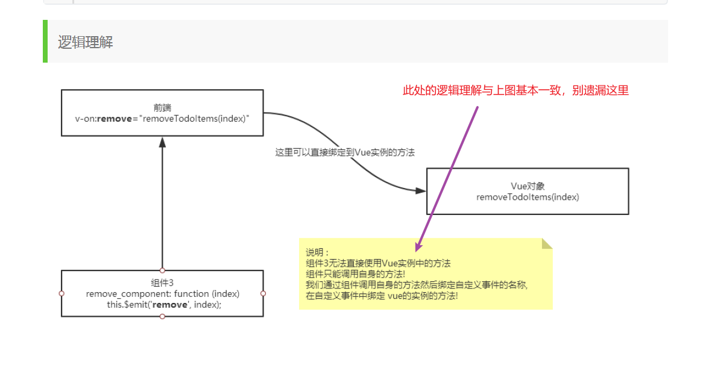

# 一、Vue基础语法

## （0）潜规则

### 0.1

```html
<div id="here">
    与我绑定的vue对象的属性，我随便用，就是这么任性！！！
</div>

<script>
	var vm=new Vue({
        el:'#here',
        data:{
            there:9527
        }
    });
</script>
```

### 0.2

```html
js语法必须适用，数组或其他的方法可以完美使用，比如：数组arr.pop()等。
```


## （1）v-bind

### 1.1第一种绑定方式：文本插值-插值表达式{{}}

```html
    <div id="a">
       <span>{{msg}}</span>

   	</div>
	
    <script src="https://cdn.jsdelivr.net/npm/vue@2"></script>
    <script>
        var vm=new Vue({
            el: '#a',
            data:{
                msg:'aaaaa'
            }
        })
    </script>
```

通过=={{x}}==的方式绑定vue对象的data元素，从而实现两者的绑定，改变vm.msg即可动态改变文本的值。


### 1.2第二种绑定方法：绑定元素 attribute（属性的意思）

```html
    <div id="a">
       <span v-bind:title="msg">悬浮于此，稍后可显示数值</span>

    </div>

	<!--如果要将模型数据绑定在html属性中 则使用 v-bind 指令,此时title中显示的是模型数据 -->
	<!-- v-bind 指令的简写形式： 冒号（:） -->

    <script src="https://cdn.jsdelivr.net/npm/vue@2"></script>
    <script>
        var vm=new Vue({
            el: '#a',
            data:{
                msg:'aaaaa'
            }
        })
    </script>
```

- 关于“title”：（来自w3s）

- 关于v-bind:（来自官方文档）

  

- 个人见解：
  - 格式：==v-bind:x=‘y==’；（备注：单引号和双引号基本无区别）
  - x代表当前所在组件或标签的属性，如这里span中的title属性
  - y代表vue实例对象中的元素，如这里的vm.msg
  - v-bind 指令的简写形式： 冒号（:)


## （2）v-if

```html
    <div id="b">
      <h1 v-if="score<60">不及格！！！</h1>
      <h1 v-else-if="score<90">良好~</h1>
      <h1 v-else>优秀啊，小伙子！！！！！</h1>

    </div>

    <script src="https://cdn.jsdelivr.net/npm/vue@2"></script>
    <script>
        var vm=new Vue({
            el: '#b',
            data:{
                score:0
            }
        })
    </script>
```


**个人总结：**

- 格式：==v-if\===“在此输入条件”；v-else-if;v-else；这三种是他的全部了doge
- 其实一个【v-if=】很多时候即可完成另外俩哥们儿的活儿，顶多麻烦一些，当然有的活干不了，尤其是v-else有他独特的用处

**官方表述：**

- 这个例子演示了我们不仅可以把数据绑定到 DOM 文本或 attribute，还可以绑定到 DOM **结构**。此外，Vue 也提供一个强大的过渡效果系统，可以在 Vue 插入/更新/移除元素时自动应用[过渡效果](https://v2.cn.vuejs.org/v2/guide/transitions.html)。

- 初学，我还不太明白，但我知道，通过使用v-if可以**实现DOM结构的绑定**。

## （3）v-for

```html
    <!-- 用class，换个口味~ -->
    <div class="c">
        <h1 v-for="ele in arr">
            {{ele}}
        </h1>

    </div>

    <script src="https://cdn.jsdelivr.net/npm/vue@2"></script>
    <script>
        var vm=new Vue({
            el: '.c',
            data:{
                arr:[8848,'小米手机',true,3.1415926]
            }
        })
    </script>
```

**总结：**

- 格式：==v-for\===“里面写循环过程语句，类似c或Java语言”
- 这里的很简单，后续和其他指令结合起来会复杂，所以，别得意


## （4）v-on

```html
   <div id="cmd">
    <h1>{{message}}</h1>
    <button v-on:click="reverseMessage">反转消息</button>
   </div>


    <script src="https://cdn.jsdelivr.net/npm/vue@2"></script>
    <script>
        var vm = new Vue({
            el: '#cmd',
            data: {
                message: 'Hello Vue.js!'
            },
            methods: {
                reverseMessage: function () {
                    this.message = this.message.split('').reverse().join('')
                }
            }
        })
    </script>
```

**总结：**

- vue实例对象中，方法放在methods中
- 官方表述：“为了让用户和你的应用进行交互，我们可以用 `v-on` 指令添加一个事件监听器，通过它调用在 Vue 实例中定义的方法”
- 注意在 `reverseMessage` 方法中，我们更新了应用的状态，但没有触碰 DOM——所有的 DOM 操作都由 Vue 来处理，你编写的代码只需要关注逻辑层面即可。

- split('').reverse().join('')方法类似于Python中的对应方法

- 格式：==v-on:xx=“”==
- 简写：==@xx\=""==


## （5）v-model

```html
    <div id="cmd">
        <p>{{ message }}</p>
        <input v-model="message">
      </div>

    <script src="https://cdn.jsdelivr.net/npm/vue@2"></script>
    <script>
        var vm = new Vue({
            el: '#cmd',
            data: {
                message: 'Hello Vue.js!'
            }
        })
    </script>
```

**总结：**

- Vue 提供的 `v-model` 指令，它能轻松实现**表单输入和应用状态之间的双向绑定**
- 格式：==v-model\="xx"==
- 完成绑定后，input框内【初始值】也对应变为message，也可通过这个进行初始化赋值，虽然有点“浪费”


# 二、初步进阶

## （1）组件化应用创建

### 

```html
    <div id="cmd">
       <zzx v-for="x in arr" v-bind:val="x" v-bind:key="x.id"></zzx>
    </div>

    <script src="https://cdn.jsdelivr.net/npm/vue@2"></script>
    <script>

        Vue.component('zzx',{
            props: ['val'],
            template: '<h1>{{val.text}},id={{val.id}}</h1>'
        });

        var vm = new Vue({
            el: '#cmd',
            data: {
               arr: [{ id: 0, text: '蔬菜' },
                    { id: 1, text: '奶酪' },
                    { id: 2, text: '随便其它什么人吃的东西' }
                ]
            }
        });
```


**官方解释：**

> 尽管这只是一个刻意设计的例子，但是我们已经设法将应用分割成了两个更小的单元。==子单元通过 prop 接口与父单元进行了良好的解耦==。我们现在可以进一步改进 `<todo-item>` 组件，提供更为复杂的模板和逻辑，而不会影响到父单元。
>
> 在一个大型应用中，有必要将整个应用程序划分为组件，以使开发更易管理。在[后续教程](https://v2.cn.vuejs.org/v2/guide/components.html)中我们将详述组件，不过这里有一个 (假想的) 例子，以展示使用了组件的应用模板是什么样的：
>
> ```html
> <div id="app">
>   <app-nav></app-nav>
>   <app-view>
>     <app-sidebar></app-sidebar>
>     <app-content></app-content>
>   </app-view>
> </div>
> ```




## （2）计算属性

```html
    <div id="cmd">
       <h1>{{getTime}}</h1>
    </div>

    <script src="https://cdn.jsdelivr.net/npm/vue@2"></script>
    <script>

        var vm = new Vue({
            el: '#cmd',
            data: {
              msg:'hello world!!!'
            },
            computed: {
                getTime: function(){
                    this.msg;
                    return Date.now();
                }
            }
        });


    </script>
```

**总结：**

- 对于任何复杂逻辑，你都应当使用**计算属性**。
- 
- 


## （3）网络通信axios与生命周期

### 3.1生命周期


### 3.2网络通信axios

```html
<!DOCTYPE html>
<html lang="en">

<head>
    <meta charset="UTF-8">
    <meta http-equiv="X-UA-Compatible" content="IE=edge">
    <meta name="viewport" content="width=device-width, initial-scale=1.0">
    <title>Document</title>

    <!--v-cloak 解决闪烁问题：用白屏代替闪过的代码--> <style> [v-cloak] { display: none; } </style>

</head>

<body>
    <div id="cmd" v-cloak>
    {{info}}
    <a :href="info.url">点我试试~</a>
    </div>

    <script src="https://cdn.jsdelivr.net/npm/vue@2"></script>
    <!--引入axios-->
    <script src="https://unpkg.com/axios/dist/axios.min.js"></script>
    <script>

        var vm = new Vue({
            el: '#cmd',
            data: {
              msg:'hello world!!!'
            },
            //须是data()方法
            data(){
                //return是必要的
                return{
                    //info为空即可，无需手写内容
                    info:{}
                }
            },
            mounted () {//钩子函数，可借助生命周期图理解
                //初步理解测试用以下三行：
                // axios.get('data.json').then(function(response){console.log('you win~')})
                //或者用箭头函数代替也可：(response=>{console.log('恭喜你，成功了。')})
                //再或者用js中的另一种方式：then(response=function(){console.log('success')})

                //实际应用：将json的数据给到data（）里的属性接受
                axios.get('data.json').then(response=>(this.info=response.data))
            }
        });

    </script>

</body>

</html>
```

**内容基本都在代码中。**


==新问题的发现与解决（10.3）==

`问题：`


`问题分析:`

- 原句翻译：

> 访问XMLHttpRequest在'文件:///E:/%E7%BC% 96宝嵘7% a8 %8B%E5%BC% 80宝嵘5%8F%91/%E5%89%8D%E7%AB%AF/vue/vue-second/data。跨源请求只支持协议方案:http, data, chrome-extension, edge, chrome-untrusted, https, isolation -app。

- 通过查阅，发现是==跨域问题==，于是有了以下解决方案：

  

  

  


## （4）插槽slot

```html
    <div id="slot-demo">
        <base-layout>
            <one slot="o1" :c1="title"></one>
            <two slot="o2" v-for="col in color" :c2="col"></two>
            <three slot="o3" :c3="bottom"></three>
        </base-layout>
    </div>

    <script src="https://cdn.jsdelivr.net/npm/vue@2"></script>
    <script>
        Vue.component('one', {
            props: ['c1'],
            template: '<h1>{{c1}}</h1>'
        });

        Vue.component('two', {
            props: ['c2'],
            template: '<li>{{c2}}</li>'
        });

        Vue.component('three', {
            props: ['c3'],
            template: '<h2>{{c3}}</h2>'
        });

        Vue.component('base-layout',{
            template:`<div class="container">
                        <header>
                            <slot name="o1"></slot>
                        </header>
                        <main>
                            <slot name="o2"></slot>
                        </main>
                        <footer>
                            <slot name="o3"></slot>
                        </footer>
                    </div>`
        });

        var vm=new Vue({
            el:'#slot-demo',
            data:{
                title:'colors',
                color:['black','red','yellow'],
                bottom:'this is end, you win!'
            }
        })

    </script>
```

`个人分析：`


`狂神总结：`


`注意点：`

插槽的内容只能包含一个根节点。

## （5）自定义事件

```html
   <div id="slot-demo">
        <base-layout>
            <one slot="o1" :c1="title"></one>
            <two slot="o2" v-for="(col,id) in colors" :c2="col" :c2id="id" @remove="deleteEle(id)"></two>
            <three slot="o3" :c3="bottom"></three>
        </base-layout>
    </div>

    <script src="https://cdn.jsdelivr.net/npm/vue@2"></script>
    <script>
        Vue.component('one', {
            props: ['c1'],
            template: '<h1>{{c1}}</h1>'
        });

        Vue.component('two', {
            props: ['c2','c2id'],
            template: '<li>{{c2}}|id:{{c2id}} <button @click="del">删除</button></li>',
            methods: {
                del:function(c2id){
                    // 这里的 remove 是自定义事件的名称，需要在 HTML 中使用 v-on:remove 的方式指派
                    this.$emit('remove',c2id)
                }
            }
        });

        Vue.component('three', {
            props: ['c3'],
            template: '<h2>{{c3}}</h2>'
        });

        Vue.component('base-layout',{
            template:`<div class="container">
                        <header>
                            <slot name="o1"></slot>
                        </header>
                        <main>
                            <slot name="o2"></slot>
                        </main>
                        <footer>
                            <slot name="o3"></slot>
                        </footer>
                    </div>`
        });

        var vm=new Vue({
            el:'#slot-demo',
            data:{
                title:'TITLE',
                colors:['black','red','yellow'],
                bottom:'this is end, you win!'
            },
            methods:{
                deleteEle:function(index){
                    this.colors.splice(index, 1)
                    // splice() 方法向/从数组中添加/删除项目，然后返回被删除的项目
					// 其中 index 为添加/删除项目的位置，1 表示删除的数量
                }
            }
        })

    </script>
```




==新发现==


# 三、高级应用

## （1）vue脚手架安装

推荐使用c站的这篇，非常详细，也解决了困扰我半天的问题：

> http://t.csdn.cn/6Wvzl


## （2）错误解析

> 基本都是版本不匹配问题，查阅百度即可得到相应对策。


## （3）重复点击路由问题

### ①解决方案

我的vue版本是***2.9.6***，在重复点击路由时，出现了`“ NavigationDuplicated: Avoided redundant navigation to current location: "/home"”`的错误，经过查阅资料，要在==router/index.js==文件中添加如下配置，可以解决：

```js
// 先把VueRouter原型对象的push replace  方法保存一份
let originPush = Router.prototype.push
let originReplace = Router.prototype.replace
// 重写push方法 第一个参数
// 第一个参数：需要跳转的地址（传递哪些参数）
// 第二个参数：成功的回调
// 第三个参数：失败的回调
Router.prototype.push = function (location, resolve, reject) {
  // console.log(this);//实例
  // 判断如果成功或失败回调已经传了
  if (resolve && reject) {
  // call 调用函数一次  改变this指向
    originPush.call(this, location, resolve, reject)
  } else {
    originPush.call(this, location, () => {}, () => {})
  }
}

Router.prototype.replace = function (location, resolve, reject) {
  if (resolve && reject) {
    originReplace.call(this, location, resolve, reject)
  } else {
    originReplace.call(this, location, () => {}, () => {})
  }
}
```

### ②方案分析

==首先了解回调函数：==


==然后认识resolve和reject两个回调函数：==


==最后得到结论：==

> 第一次访问路由时，访问location，同时执行回调函数resolve和reject，并变更promise以及两个回调函数的状态；
>
> 当重复点击时，只访问location，不再执行回调函数，即resolve和reject，这样不必多次改变promise状态，自然不会报错


## （4）vue中的驼峰命名和短横线命名


## （5）Vue配置根目录@（引用路径）


`在我自己电脑安装的vue中，服从旧版本的配置`


## （6）修改端口号

### 1.法一:


### 2.法二：


## （7）\<style> 和 \<style scoped>


## （8）vue的style中如何引入css文件

> vue引用css的方法：
>
> 1、全局引入，语法格式为“import 'css文件地址'”；
>
> 2、局部引入，语法格式为“\<style scoped>@import 'css文件地址';\</style>”。
>
> 


## （9）回调函数

`颜群老师的说法如下：`


## （10）ajax

1. 详细教程见纸质书《javaweb应用开发-颜群》‘
2. 常用jQuery实现方式：

> 当我们用javascript写ajax程序写得很“开心”的时候，突然有人告诉你有一种东西叫jquery，它会告诉你不直接和 HttpRequest是多么的快乐，同时你再也不需要再烦恼纠结的ajax乱码问题，更幸福的是你的js代码将大大地简化，看完本文，你会发 现，ajax，简单的来讲就是一句话的事情。
>
> 本文重点是来讲讲jQuery中调用ajax的4种方法：$.get、$.post、$getJSON、$ajax。如果读者没有javascript和jquery的知识，或者没有ajax的概念，那么请先去问问google老大，再来读本文。
>
> 1、==$.get==
>
> $.get()方法使用GET方式来进行异步请求，它的语法结构为：
>
> $.get( url [, data] [, callback] )
>
> 解释一下这个函数的各个参数：
>
> url：string类型，ajax请求的地址。
>
> data：可选参数，object类型，发送至服务器的key/value数据会作为QueryString附加到请求URL中。
>
> callback：可选参数，function类型，当ajax返回成功时自动调用该函数。
>
> 最后写一个$.get()的实例供大家参考：
>
>  ```js
> $.get(    "submit.aspx",
> 
> ​         {        id:     '123',        name:   '青藤园',    },
> 
> ​         function(data,state){        
> 
> ​         //这里显示从服务器返回的数据        
> 
> ​        alert(data);       
> 
> ​         //这里显示返回的状态     
> 
> ​        alert(state);    })
>  ```
>
> 
>
> 2、==$.post()==
>
> $.post()方法使用POST方式来进行异步请求，它的语法结构为：
>
> $.post(url,[data],[callback],[type])
>
> 这个方法和$.get()用法差不多，唯独多了一个type参数，那么这里就只介绍type参数吧，其他的参考上面$.get()的。
>
> type：type为请求的数据类型，可以是html,xml,json等类型，如果我们设置这个参数为：json，那么返回的格式则是json格式的，如果没有设置，就和$.get()返回的格式一样，都是字符串的。
>
> 最后写一个$.post()的实例供大家参考：
>
>  ```js
> $.post(    "submit.aspx",
>         {        id:     '123',        name:   '青藤园',    },
>         function(data,state){        
>         //这里显示从服务器返回的数据        
> 
> ​              alert(data);       
> 
> ​        //这里显示返回的状态      
> 
> ​              alert(state);   
> 
> ​         },    
> 
> ​        "json");
>  ```
>
> 
>
> 3、==$.getJSON()==
>
> $.getJSON()是专门为ajax获取json数据而设置的，并且支持跨域调用，其语法的格式为：
>
> getJSON(url,[data],[callback])
>
> url：string类型， 发送请求地址
> data ：可选参数， 待发送 Key/value 参数 ，同get，post类型的data
> callback ：可选参数，载入成功时回调函数，同get，post类型的callback
>
> JSON 是一种理想的数据传输格式，它能够很好的融合与JavaScript或其他宿主语言，并且可以被JS直接使用。使用JSON相比传统的通过 GET、POST直接发送“裸体”数据，在结构上更为合理，也更为安全。至于jQuery的getJSON()函数，只是设置了JSON参数的 ajax()函数的一个简化版本。这个函数也是可以跨域使用的，相比get()、post()有一定优势。另外这个函数可以通过把请求url写 成"myurl?callback=X"这种格式，让程序执行回调函数X。
>
> 提示：数据最终还是通过url后面通过get方式发送数据出去的，这就决定了，发送的data数据量不能太多，否则造成url太长接收失败（getJSON方式是不可能有post方式递交的）。
>
> ==4、$.ajax()==
>
> $.ajax()是jquery中通用的一个ajax封装，其语法的格式为：
>
> $.ajax(options)
>
> 其中options是一个object类型，它指明了本次ajax调用的具体参数，这里我把最常用的几个参数附上
>
>  
>
> $.ajax({
>
> ​        url: 'submit.aspx',
>
> ​        datatype: "json",
>
> ​        type: 'post',
>
> ​        success: function (e) {
>
> ​        //成功后回调
>
> ​            alert(e);
>
> ​         },
>
> ​        error: function(e){
>
> ​    //失败后回调
>
> ​            alert(e);
>
> ​        },
>
> ​        beforeSend: function(){
>
>  //发送请求前调用，可以放一些"正在加载"之类额话
>
> ​            alert("正在加载");        
>
> }})
>
> 好了，以上就是jquery实现ajax调用的几种方法，希望对大家有所帮助。
>
> 原文链接：www.cnblogs.com/conmecon/p/3281577.html


## （11）vue-router的配置index.js


## （12）浅谈vue中index.html、main.js、App.vue、index.js之前的关系以及加载过程

### 前序

承接上一遍“通过webpack构建vue项目”构建的项目文件，简单阐述一下当我们构建完成后，vue项目中的index.html、main.js、App.vue、index.js的运行加载过程，以及首界面是如何出现的，逐步了解vue项目，

**简介**

项目部署完成后的项目结构以及解释如下图所示


项目运行

项目的运行入口index.html

 为什么index.html是项目的入口以及为什么index.html加载后会继续加载main.js、App.vue、index.js，以及他们之间的关系是如何联系起来的呢，这块的配置文件位于build文件夹下，包括webpack.dev.conf.js等，感兴趣的可以了解下。通过项目的配置文件，可以加载运行我们的index.html文件以及自动关联vue相关的模块。

首先我们来看一下index.html中的内容

<!DOCTYPE html>
<html>
  <head>
    <meta charset="utf-8">
    <meta name="viewport" content="width=device-width,initial-scale=1.0">
    <title>y</title>
  </head>
  <body>
    <div id="app"></div>
    <!-- built files will be auto injected -->
  </body>
</html>
在body体中只有一个div标签，其id为app,这个id将会连接到src/main.js内容，接着我们看一下main.js中的主要的代码
```js
// The Vue build version to load with the `import` command
// (runtime-only or standalone) has been set in webpack.base.conf with an alias.
import Vue from 'vue'
import App from './App'
import router from './router'

Vue.config.productionTip = false

/* eslint-disable no-new */
new Vue({
  el: '#app',
  router,
  components: { App },
  template: '<App/>'
})
```


在main.js中，新建了一个vue实例，并使用el：#app链接到index.html中的app，并使用template引入组件<app>和路由相关的内容（具体的涉及到vue的语法规则，如果不理解的先记下来吧，继续往后看，等了解vue的相关内容后，可能会更清晰）。也就是说通过main.js我们关联到App.vue组件，接着，我们继续看一下App.vue组件中的内容。

 ```js


<template>
  <div id="app">
    
    <router-view/>
  </div>
</template>

<script>
export default {
  name: 'App'
}
</script>

<style>
#app {
  font-family: 'Avenir', Helvetica, Arial, sans-serif;
  -webkit-font-smoothing: antialiased;
  -moz-osx-font-smoothing: grayscale;
  text-align: center;
  color: #2c3e50;
  margin-top: 60px;
}
</style>
```

看一下App.vue中的内容，是一个标准的App.vue模板的形式，包含了\<template>\</template>、\<script>\</script>、\<style>\</style>三部分，从template标签中可以看到，使用img标签加载了vue的图像，也就是我们使用npm run dev运行vue项目后看到的图像，那么图像下面的内容是从哪里渲染出来的呢？

我们注意到，\<template>标签下，除了\标签外，还有\<router-view>标签，\<router-view>标签将会把路由相关内容渲染在这个地方，接下来，我们看一下路由的内容有哪些，在哪里出现的。其实，这个文件位于src/router/index.js中，我们看一下index.js中的代码

```js
import Vue from 'vue'
import Router from 'vue-router'
import HelloWorld from '@/components/HelloWorld'

Vue.use(Router)

export default new Router({
  routes: [
    {
      path: '/',
      name: 'HelloWorld',
      component: HelloWorld
    }
  ]
})
```


在index.js的代码中，建立了路由相关的内容，也就会渲染到app.vue下面的\<router-view>中。在index.js中，将helloworld组件发布为路由，换句说，index.js在这里就是将helloword发布为路由，以在图片下面进行展示helloword内容，接下来我们再看看components/helloword中的内容是啥(由于里面的内容比较多，这里我们只截取了template中的内容)。

```html
<template>
  <div class="hello">
    <h1>{{ msg }}</h1>
    <h2>Essential Links</h2>
    <ul>
      <li>
        <a
          href="https://vuejs.org"
          target="_blank"
        >
          Core Docs
        </a>
      </li>
      <li>
        <a
          href="https://forum.vuejs.org"
          target="_blank"
        >
          Forum
        </a>
      </li>
      <li>
        <a
          href="https://chat.vuejs.org"
          target="_blank"
        >
          Community Chat
        </a>
      </li>
      <li>
        <a
          href="https://twitter.com/vuejs"
          target="_blank"
        >
          Twitter
        </a>
      </li>
      <br>
      <li>
        <a
          href="http://vuejs-templates.github.io/webpack/"
          target="_blank"
        >
          Docs for This Template
        </a>
      </li>
    </ul>
    <h2>Ecosystem</h2>
    <ul>
      <li>
        <a
          href="http://router.vuejs.org/"
          target="_blank"
        >
          vue-router
        </a>
      </li>
      <li>
        <a
          href="http://vuex.vuejs.org/"
          target="_blank"
        >
          vuex
        </a>
      </li>
      <li>
        <a
          href="http://vue-loader.vuejs.org/"
          target="_blank"
        >
          vue-loader
        </a>
      </li>
      <li>
        <a
          href="https://github.com/vuejs/awesome-vue"
          target="_blank"
        >
          awesome-vue
        </a>
      </li>
    </ul>
  </div>
</template>
```


在helloworld.vue的template中，我们可以看到界面上渲染的一些连接等内容。到此，这个页面的加载渲染过程结束了。

### 总结

通过上述过程，我们可以看到项目加载的过程是index.tml->main.js->app.vue->index.js->helloworld.vue。这里只是对我们运行项目后，如何出现首页面做了简单的解释，对具体的实现没有进行分析。

> 原文链接：https://blog.csdn.net/qq_34182808/article/details/86690193


## （13）vue项目结构

拿到一个 vue 的项目源代码后，许多初学者对 vue 项目的文件结构感觉眼花缭乱。今天小编就来详细的介绍 vue 的目录结构。

**首先附上一个简单的 vue 项目结构图**


**node_modules**

vue 项目的文件依赖存放在这个文件夹。

**public**

存放页面图标和不支持 JavaScript 情况时的页面。

**package.json**

存放项目的依赖配置（比如 vuex，element-UI）。

**babel.config.js**

babel 转码器的配置文件。

**vue.config.js**

vue 的配置文件。

**yarn.lock**

用来构建依赖关系树。

**.gitignore**

git 忽略文件

**src**

存放 vue 项目的源代码。其文件夹下的各个文件（文件夹）分别为：

**assets：**资源文件，比如存放 css，图片等资源。

**component：**组件文件夹，用来存放 vue 的公共组件（注册于全局，在整个项目中通过关键词便可直接输出）。

**router:**用来存放 index.js，这个 js 用来配置路由

**tool：**用来存放工具类 js，将 js 代码封装好放入这个文件夹可以全局调用（比如常见的 api.js，http.js 是对 http 方法和 api 方法的封装）。

**views：**用来放主体页面，虽然和组件文件夹都是 vue 文件，但 views 下的 vue 文件是可以用来充当路由 view 的。

**main.js:**是项目的入口文件，作用是初始化 vue 实例，并引入所需要的插件。

**app.vue:**是项目的主组件，所有页面都是在该组件下进行切换的。

**小结**

vue 的项目结构看似很复杂，其实很多地方并不需要我们去修改，正常开发的时候一般只修改 src 文件夹下的文件。因为组件化的开发方式，使得文件的数量多了起来，但是只要熟悉这个项目，自然能对项目的各个文件如数家珍。


## （14）axios的安装与应用

### 1.安装：命令行输入以下语句

> npm install axios --save


### 2.使用：

#### 2.1 基本使用

##### 2.1.1 在main.js引入


##### 2.1.2 组件中使用


`更为复杂和完整的使用方式（后续补充）`

#### 2.2. axios的封装和全局配置

##### 为什么要全局配置？

1. 全局配置在每一次发起请求时都可以单独配置，但如果是一些所有请求都必要添加的配置项时，就可以进行全局配置，会节省很多代码，并且更加优雅
2. 是不是全局配置后，组件里每次使用axios发起请求，就不用引入了？答案是：**是的**

###### axiox安装

如果你使用的是 npm


```git
$ npm install axios -S
```

cnpm 同样


```git
$ cnpm install axios -S
```

如果你使用 yarn


```git
$ yarn add axios -S
```

##### 标题目录

- 文件目录
- 全局配置
  - 添加配置项
  - 引入配置
  - 在组件中使用
- 拦截器封装
  - 拦截器工作流程
  - 请求和响应封装
  - 带有全局配置的拦截器封装
  - 引入拦截器

##### 文件目录

axios的全局配置和拦截器封装，你可以创建一个js文件来管理，**可以放在任何你想放的位置**

但是，最后一定要在**main.js项目入口文件中引入**，并且与Vue实例进行关联。

当然你也可以直接写在main.js中，但可能会显得入口文件的代码过于臃肿。

> 我选择在src目录下创建一个axios文件夹，然后在里面创建一个index.js文件，用来管理axios的全局配置和拦截器封装
>  路径： ./src/axios/index.js


##### 全局配置

步骤：

1. 添加配置项
2. 引入配置实例
3. 在组件中使用

##### 添加配置项

在axios/index.js文件中按照以下步骤，进行全局配置：

1. 引入axios
2. 创建一个axios实例
3. 对该实例的传递一个对象，该对象就是全局配置信息
4. 将该实例导出


```js
// 1. 引入
import axios from "axios";

// 2. 配置信息
let config = {
    // 每次请求的协议、IP地址。  设置该配置后，每次请求路径都可以使用相对路径，例如"/admin/login"
    baseURL: "http://localhost",
    // 请求超时时间
    timeout: 10000,
    // 每次请求携带cookie
    withCredentials: true
}

// 3. 创建实例
const instance = axios.create(config)

// 4. 导出
export default instance
```

如果你想进行更多的全局配置，可在官网查看：[axios中文网 - 请求配置项](https://links.jianshu.com/go?to=http%3A%2F%2Fwww.axios-js.com%2Fzh-cn%2Fdocs%2F%23%E8%AF%B7%E6%B1%82%E9%85%8D%E7%BD%AE)

##### 引入配置

既然要实现整个项目全局的操作，那么就要在入口文件main.js里面下文章

1. 在main.js中引入刚才进行配置的axios实例
2. 把该实例设置为Vue原型中的一个方法


```js
main.js

import ...

// 1. 引入实例
import axios from './axios'
// 因为我在 axios 文件夹下只创建了一个 index.js 文件，那么 webpack 会默认把该文件打包，所以这里的路径可以不用加上 '/index.js' 
// 如果你创建的文件名不是 index，那么一定要加上文件名
// 如果你的 axios 配置文件跟我创建的路径不一样，那么按照你的路径引入就可以了

// 2. 与Vue实例关联
Vue.prototype.$axios = axios

new Vue({
  ...
})
```

##### 在组件中使用

因为我们把 axios 封装成 Vue原型中的一个方法，那么我们**在组件中就不用再引入 axios**

并且我们进行了全局配置，再在组件中单独引入axios ，引入的是一个新的实例，而不是包含全局配置项的实例


```html
test.vue

<template>
  <div>
    <button @click="handleClick"></button>
  </div>
</template>

<script>
  export default {
    methods: {
      handleClick(){
        // 就像使用 $store、$route 一样
        this.$axios.post("/getList", {pid: 157})
        .then(res => console.log(res))
        .catch(err => console.log(err))
      }
    }
  }
</script>
```

> 作者：夜晚有三年_wyl
> 链接：https://www.jianshu.com/p/5dbb273254ae
> 来源：简书
> 著作权归作者所有。商业转载请联系作者获得授权，非商业转载请注明出处。


### 3. axios使用·总结

#### 3.1 无@requestbody时

```js
let params = new URLSearchParams();// 一定要new URLSearchParams();
      params.append('userId', id);
      this.$axios
        (
          {
            method: 'get',
            url: '/user/getUserById',
            params
          }
        ).then((result) => {
         	console.log(result)
        }).catch((err) => {
          console.log(err);
        });
```

#### 3.2 有@requestbody参数时

```js
 this.$axios.put
        (
          '/user/updateUserById',
          {//request-body
            userId: id,
            userName: user.userName,
            userSex: user.userSex,
            userStatus: user.userStatus,
            userAvatar: null,
            isSinger: user.isSinger,
            fansNum: user.fansNum,
            idolNum: user.idolNum,
            account: user.account,
            pwd: user.pwd,
            createTime: new Date(),
            updateTime: new Date(),
            isDeleted: false
          },
          {//request-query
            params: {

            },
            headers: {
              'Content-type': 'application/json'
            }
          }
        ).then((result) => {
		  console.log(result);
        }).catch((err) => {
          console.log(err);
        });
```


## （15）嵌套路由


## （16）实现flex布局

1. 在要操作的父div中设置display：flex
2. 如果是想让两个div每个div占百分之n的宽度. 比如想让第一个div占宽度的百分之30. 第二个占百分之70.可以设置第一个div:flex:3; 第二个div:flex:7
3. 如图：


## （17）设置el-input的宽度


## （18）获取element-ui表格中的渲染的prop值


## （19）将URL中的#去掉

在router/index.js中，route对象里，加入：`mode: ‘history’`


## （20）vue中axios使用post方式以及对出现的问题进行解决

### 1. 配置类参数形式


### 2. 400错误


###  3.405错误


 

## （21） Duplicate keys detected: '9527'. This may cause an update error.报错解决


## （22）vuex初步认识和使用

### 1.初步认识


### 2.具体使用

具体使用参照PPT课件：[链接](https://gitee.com/crzzx/word-press-database/blob/master/%E5%AD%A6%E4%B9%A0%E8%B5%84%E6%96%99/%E5%89%8D%E7%AB%AF/vue/13.%E7%8A%B6%E6%80%81%E7%AE%A1%E7%90%86VueX.pptx)


## （23）foreach的使用


## （24）scope.row的理解

> 摘自：[Vue之scope.row的最简单理解](https://www.cnblogs.com/Timeouting-Study/p/15477083.html)


## （25）vue this.$refs汇总

##### this.$refs介绍

- this.$refs是一个对象，持有当前组件中注册过 ref特性的所有 DOM 元素和子组件实例

> 注意： $refs只有在组件渲染完成后才填充，在初始渲染的时候不能访问它们，并且它是非响应式的，因此不能用它在模板中做数据绑定

- 当ref和v-for一起使用时，获取到的引用将会是一个数组，包含循环数组源

```xml
<template>
  <div>
    <div ref="myDiv" v-for="(item, index) in arr" :key="index">{{item}}</div>
  </div>
</template>
 
<script>
export default {
  data() {
    return {
      arr: ['one', 'two', 'three', 'four']
    }
  },
  mounted() {
    console.log(this.$refs.myDiv)
  },
  methods: {}
}
</script>
 
<style lang="sass" scoped>
 
</style>
 
复制代码
```


##### 基本用法，本页面获取dom元素

```xml
<template>
  <div id="app">
    <div ref="testDom">11111</div>
    <button @click="getTest">获取test节点</button>
  </div></template>

<script>
export default {
  methods: {
    getTest() {
      console.log(this.$refs.testDom)
    }
  }
};
</script>
复制代码
```

![Image [2].png](./img/b3be631877be4860a4adbe928511b290tplv-k3u1fbpfcp-zoom-in-crop-mark4536000-1679273638337-55.webp)

- 其实ref除了可以获取本页面的dom元素，还可以拿到子组件中的data和去调用子组件中的方法

##### 获取子组件中的data

- 子组件

```xml
<template>
  <div>
      {{ msg }}
  </div></template>

<script>
export default {
  data() {
    return {
      msg: "hello world"
    }
  }
}
</script>
复制代码
```

- 父组件

```xml
<template>
  <div id="app">
    <HelloWorld ref="hello"/>
    <button @click="getHello">获取helloworld组件中的值</button>
  </div></template>

<script>
import HelloWorld from "./components/HelloWorld.vue";

export default {
  components: {
    HelloWorld
  },
  data() {
    return {}
  },
  methods: {
    getHello() {
      console.log(this.$refs.hello.msg)
    }
  }
};
</script>
复制代码
```

![Image [3].png](./img/f31eb56eb3834b6b9cf839d971953ee8tplv-k3u1fbpfcp-zoom-in-crop-mark4536000-1679273638337-56.webp)

##### 调用子组件中的方法

- 子组件

```xml
<template>
  <div>
  </div></template>

<script>
export default {
  methods: {
    open() {
      console.log("调用到了")
    }
  }
}
</script>
复制代码
```

- 父组件

```xml
<template>
  <div id="app">
    <HelloWorld ref="hello"/>
    <button @click="getHello">获取helloworld组件中的值</button>
  </div></template>

<script>
import HelloWorld from "./components/HelloWorld.vue";

export default {
  components: {
    HelloWorld
  },
  data() {
    return {}
  },
  methods: {
    getHello() {
      this.$refs.hello.open();
    }
  }
};
</script>
复制代码
```

![Image [4].png](./img/d23957d5ec14430a9482fe29f88494e6tplv-k3u1fbpfcp-zoom-in-crop-mark4536000-1679273638337-57.webp)

##### 子组件调用父组件方法

- 子组件

```xml
<template>
  <div></div></template>

<script>
export default {
  methods: {
    open() {
      console.log("调用了");
      //  调用父组件方法
      this.$emit("refreshData");
    }
  }
}
</script>
复制代码
```

- 父组件

```xml
<template>
  <div id="app">
    <HelloWorld ref="hello" @refreshData="getData"/>
    <button @click="getHello">获取helloworld组件中的值</button>
  </div></template>

<script>
import HelloWorld from "./components/HelloWorld.vue";

export default {
  components: {
    HelloWorld
  },
  data() {
    return {}
  },
  methods: {
    getHello() {
      this.$refs.hello.open()
    },
    getData() {
      console.log('111111')
    }
  }
};
</script>
复制代码
```

![Image [5].png](./img/bd1a577b40fb4ba2b07a203aa52cd00ctplv-k3u1fbpfcp-zoom-in-crop-mark4536000-1679273638337-58.webp)

> 作者：冰美式
> 链接：https://juejin.cn/post/6948992842274439182
> 来源：稀土掘金
> 著作权归作者所有。商业转载请联系作者获得授权，非商业转载请注明出处。


**Additions:**

> 1. ref 写在标签上时：this.$refs.名字  获取的是标签对应的dom元素     
> 2. ref 写在组件上时：这时候获取到的是 子组件（比如counter）的引用
> 3. 源自：https://blog.csdn.net/qq_37767455/article/details/102485242


## （26）vue sessionStorage存值取值问题

> 原文链接：https://blog.csdn.net/qq_36538012/article/details/119206789


## （27）element ui表格显示图片

```js
    那个api是我接口的前缀地址 comImage是接口返回的数据
    < el-table-column prop= "comImage" label= "公司Logo" align= "center" width= "150px" padding= "0px"
    :show-overflow-tooltip = "true">
         < template slot-scope= "scope">
              < img :src="api + scope.row.comImage" alt= "" style= "width: 36px;height:36px">
         </ template>
      </ el-table-column>
————————————————
版权声明：本文为CSDN博主「Feast_aw」的原创文章，遵循CC 4.0 BY-SA版权协议，转载请附上原文出处链接及本声明。
原文链接：https://blog.csdn.net/Feast_aw/article/details/80945399
```


## （28）Vue Element UI 使用 Notification 组件--报错 this.$notify is not a function


> 参考自：https://blog.csdn.net/weixin_41542329/article/details/125385543
