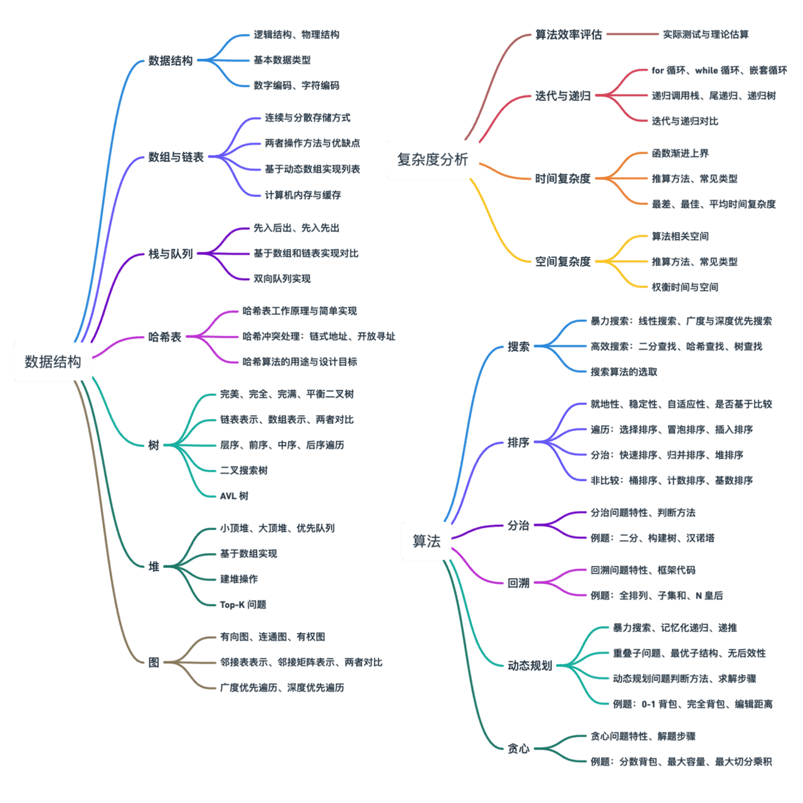
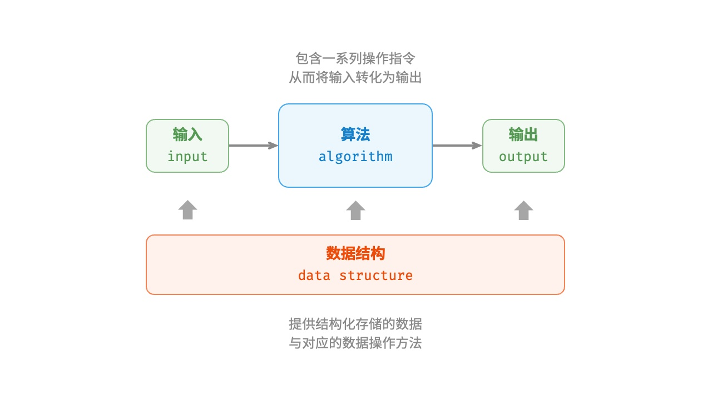

# 基础算法

## 主要内容结构

---

- **复杂度分析**：数据结构和算法的评价维度与方法。时间复杂度和空间复杂度的推算方法、常见类型、示例等。
- **数据结构**：基本数据类型和数据结构的分类方法。数组、链表、栈、队列、哈希表、树、堆、图等数据结构的定义、优缺点、常见操作、常见类型、典型应用、实现方法等。
- **算法**：搜索、排序、分治、回溯、动态规划、贪心等算法的定义、优缺点、效率、应用场景、解题步骤和示例问题等。

## 算法与数据结构

---

### 算法定义

「算法 algorithm」是在有限时间内解决特定问题的一组指令或操作步骤，它具有以下特性。

- 问题是明确的，包含清晰的输入和输出定义。
- 具有可行性，能够在有限步骤、时间和内存空间下完成。
- 各步骤都有明确的含义，在相同的输入和运行条件下，输出始终相同。

### 数据结果定义

「数据结构 data structure」是计算机中组织和存储数据的方式，具有以下设计目标。

- 空间占用尽量少，以节省计算机内存。
- 数据操作尽可能快速，涵盖数据访问、添加、删除、更新等。
- 提供简洁的数据表示和逻辑信息，以便算法高效运行。

数据结构设计是一个充满权衡的过程。如果想在某方面取得提升，往往需要再另一方面做出妥协。下面举两个例子。

- 链表相较于数据，在数据添加和删除操作上更加便捷，但牺牲了数据访问速度。
- 图相较于链表，提供了更丰富的逻辑信息，但需要占用更大的内存空间。

### 数据结构和算法的关系

数据结构与算法高度相关、紧密结合，具体表现在以下三个方面。

- 数据结构是算法的基石。数据结构为算法提供了结构化存储的数据，以及操作数据的方法。
- 算法是数据结构发挥作用的舞台，数据结构本身仅存储数据信息，结合算法才能解决特定问题。
- 算法通常可以基于不同的数据结构实现，但执行效率可能相差很大，选择合适的数据结构是关键。

注意：数据结构与算法是独立于编程语言的。

## 复杂度分析

---

### 算法效率评估

在算法设计中，我们先后追求以下两个层面的目标。

1. **找到问题解法：**算法需要再规定的输入范围内可靠地求得问题的正确解。
2. **寻求最优解法：**同一个问题可能存在多种解法，我们希望可以尽可能高效的算法。

也就是说，在能够解决问题的前提下，算法效率已成为衡量算法优劣的主要评价指标，它包括以下两个维度。

- **时间效率：** 算法运行速度的快慢。
- **空间效率：** 算法占用内存空间的大小。

简而言之，**我们的目标是设计“既快又省”的数据结构与算法**。而有效地评估算法效率至关重要，因为只有这样我们才能将各种算法进行对比，进而指导算法设计与优化过程。

效率评估方法主要分为两种：实际测试、理论估算。

#### 实际测试

假设我们现在有算法 A 和算法 B，它们都能够
