---
# 此页面会在文章列表置顶
sticky: true
# 此页面会出现在文章收藏中
star: true
category: 
  - 算法
tag:
    - 基础算法
date: 2024-01-10
---

# 基础算法

## 主要内容结构

---

- **复杂度分析**：数据结构和算法的评价维度与方法。时间复杂度和空间复杂度的推算方法、常见类型、示例等。
- **数据结构**：基本数据类型和数据结构的分类方法。数组、链表、栈、队列、哈希表、树、堆、图等数据结构的定义、优缺点、常见操作、常见类型、典型应用、实现方法等。
- **算法**：搜索、排序、分治、回溯、动态规划、贪心等算法的定义、优缺点、效率、应用场景、解题步骤和示例问题等。

## 算法与数据结构

---

### 算法定义

​	「算法 algorithm」是在有限时间内解决特定问题的一组指令或操作步骤，它具有以下特性。

- 问题是明确的，包含清晰的输入和输出定义。
- 具有可行性，能够在有限步骤、时间和内存空间下完成。
- 各步骤都有明确的含义，在相同的输入和运行条件下，输出始终相同。

### 数据结果定义

「数据结构 data structure」是计算机中组织和存储数据的方式，具有以下设计目标。

- 空间占用尽量少，以节省计算机内存。
- 数据操作尽可能快速，涵盖数据访问、添加、删除、更新等。
- 提供简洁的数据表示和逻辑信息，以便算法高效运行。

​	数据结构设计是一个充满权衡的过程。如果想在某方面取得提升，往往需要再另一方面做出妥协。下面举两个例子。

- 链表相较于数据，在数据添加和删除操作上更加便捷，但牺牲了数据访问速度。
- 图相较于链表，提供了更丰富的逻辑信息，但需要占用更大的内存空间。

### 数据结构和算法的关系

数据结构与算法高度相关、紧密结合，具体表现在以下三个方面。

- 数据结构是算法的基石。数据结构为算法提供了结构化存储的数据，以及操作数据的方法。
- 算法是数据结构发挥作用的舞台，数据结构本身仅存储数据信息，结合算法才能解决特定问题。
- 算法通常可以基于不同的数据结构实现，但执行效率可能相差很大，选择合适的数据结构是关键。

注意：数据结构与算法是独立于编程语言的。

## 复杂度分析

---

### 算法效率评估

在算法设计中，我们先后追求以下两个层面的目标。

1. **找到问题解法：** 算法需要再规定的输入范围内可靠地求得问题的正确解。
2. **寻求最优解法：** 同一个问题可能存在多种解法，我们希望可以尽可能高效的算法。

​	也就是说，在能够解决问题的前提下，算法效率已成为衡量算法优劣的主要评价指标，它包括以下两个维度。

- **时间效率：** 算法运行速度的快慢。
- **空间效率：** 算法占用内存空间的大小。

​	简而言之，**我们的目标是设计“既快又省”的数据结构与算法**。而有效地评估算法效率至关重要，因为只有这样我们才能将各种算法进行对比，进而指导算法设计与优化过程。

效率评估方法主要分为两种：实际测试、理论估算。

#### 实际测试

​	假设我们现在有算法 A 和算法 B，它们都能够都能解决用一个问题，现在需要对比这两个算法的效率。最直接的方法是找一台计算机，运行这两个算法，并监控记录它们的运行时间和内存占用情况。这种评估方式能够反映真实情况，但也存在较大的局限性。

​	一方面，**难以排除测试环境的干扰因素**。硬件配置会影响算法的性能，比如在某台计算机中，算法 A 在运行时间比算法 B 短；但在另一台配置不同的计算机中，可能得到相反的测试结果。这意味着我们需要再各种机器上进行测试，统计平均效率，而这是不现实的。

​	另一方面，**展开完整测试非常耗费资源**。随着输入数据量的变化，算法会表现出不同的效率。例如，在输入数据量较小时，算法 A 的运行时间比算法 B 短；而在输入数据量较大时，测试结果可能恰恰相反。因此，为了得到有说服力的结论，我们需要测试各种规模的输入数据，而这需要耗费大量的计算资源。

#### 理论估算

​	由于实际测试具有较大的局限性，因此我们可以考虑仅通过一些计算来评估算法的效率。这种估算方法被称为「渐进复杂度分析 asymptotic complexity analysis」，简称「复杂度分析」。

​	复杂度分析能够体现算法运行所需的时间和空间资源与输入数据大小之间的关系。**它描述了随着数据大小的增加，算法执行所需时间和空间的增长趋势**。这个定义有以下三个重点：

- “时间和空间资源”分别对应「时间复杂度 time complexity」和「空间复杂度 space complexity」。
- “随着输入数据大小的增加”意味着复杂度反映了算法运行效率与输入数据体量之间的关系。
- “时间和空间的增长趋势”表示复杂度分析关注的不是运行时间或占用空间的具体值，而是时间或空间增长的“快慢”。

**复杂度分析克服了实际测试方法的**，体现在以下两个方面。

- 它独立于测试环境，分析结果适用于所有运行平台。
- 它可以体现不同数据量下的算法效率，尤其是在大数据量下的算法性能。

​	复杂度分析为我们提供了一把评估算法效率的“标尺”，使我们可以衡量执行某个算法所需的时间和空间资源，对比不同算法之间的效率。

### 迭代和递归

​	在算法中，重复执行某个任务是很常见的，它与复杂度分析息息相关。因此，在介绍时间复杂度和空间复杂度之前，我们先来了解如何在程序中实现重复执行任务，即两种基本的程序控制结构：迭代、递归。

#### 迭代

​	「迭代 iteration」是一种重复执行某个任务的控制结构。在迭代中，程序会在满足一定的条件下重复执行某段代码，直到这个条件不再满足。

##### for 循环

​	for 循环是最常见的迭代形式之一，**适合在预先知道迭代次数时使用**。
以下函数基于 for 循环实现了求和 1+2+⋯+n ，求和结果使用变量 res 记录。需要注意的是，Python 中 range(a, b) 对应的区间是“左闭右开”的，对应的遍历范围为 a, a+1,⋯, b-1；

::: tabs#code

@tab c++

~~~c++
/* for 循环 */
int forLoop(int n) {
    int res = 0;
    // 循环求和 1, 2, ..., n-1, n
    for (int i = 1; i <= n; ++i) {
        res += i;
    }
    return res;
}
~~~

@tab java

~~~java
/* for 循环 */
int forLoop(int n) {
    int res = 0;
    // 循环求和 1, 2, ..., n-1, n
    for (int i = 1; i <= n; i++) {
        res += i;
    }
    return res;
}
~~~

:::

以下是该求和函数的流程框图。

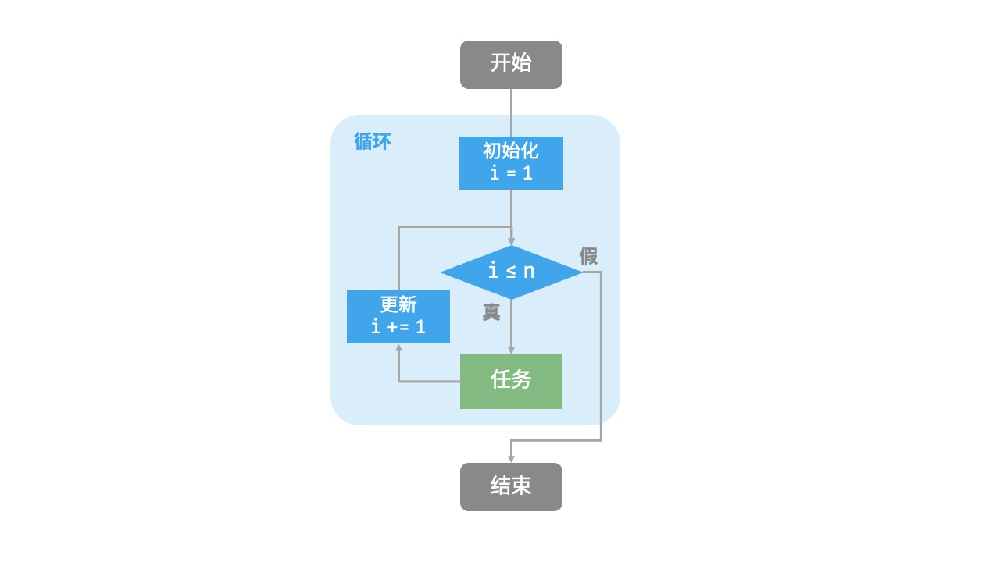

​	此求和函数的操作数量与输入数据大小 n 成正比，或者说成“线性关系”。实际上，**时间复杂度描述的就是这个“线性关系”**。

##### while 循环

​	与 for 循环类似，while 循环也是一种实现迭代的方法。在 while 循环中，程序每轮都会先检查条件，如果条件为真，则继续执行，否则就结束循环。

下面为 while 循环实现求和 1+2+3+⋯+n:

::: tabs#code

@tab c++

~~~c++
/* while 循环 */
int whileLoop(int n) {
    int res = 0;
    int i = 1; // 初始化条件变量
    // 循环求和 1, 2, ..., n-1, n
    while (i <= n) {
        res += i;
        i++; // 更新条件变量
    }
    return res;
}
~~~

@tab java

~~~java
/* while 循环 */
int whileLoop(int n) {
    int res = 0;
    int i = 1; // 初始化条件变量
    // 循环求和 1, 2, ..., n-1, n
    while (i <= n) {
        res += i;
        i++; // 更新条件变量
    }
    return res;
}
~~~

:::

​	**while 循环比 for 循环的自由度更高**。在 while 循环中，我们可以自由地设计条件变量的初始化和更新步骤。

​	例如在以下代码中，条件变量 i 每轮进行两次更新，这种情况就不太方便用 for 循环实现：

::: tabs#code

@tab c++

~~~c++
/* 双层 for 循环 */
string nestedForLoop(int n) {
    ostringstream res;
    // 循环 i = 1, 2, ..., n-1, n
    for (int i = 1; i <= n; ++i) {
        // 循环 j = 1, 2, ..., n-1, n
        for (int j = 1; j <= n; ++j) {
            res << "(" << i << ", " << j << "), ";
        }
    }
    return res.str();
}
~~~

@tab java

~~~java
/* 双层 for 循环 */
String nestedForLoop(int n) {
    StringBuilder res = new StringBuilder();
    // 循环 i = 1, 2, ..., n-1, n
    for (int i = 1; i <= n; i++) {
        // 循环 j = 1, 2, ..., n-1, n
        for (int j = 1; j <= n; j++) {
            res.append("(" + i + ", " + j + "), ");
        }
    }
    return res.toString();
}
~~~

:::

以下是该嵌套循环的流程框图。

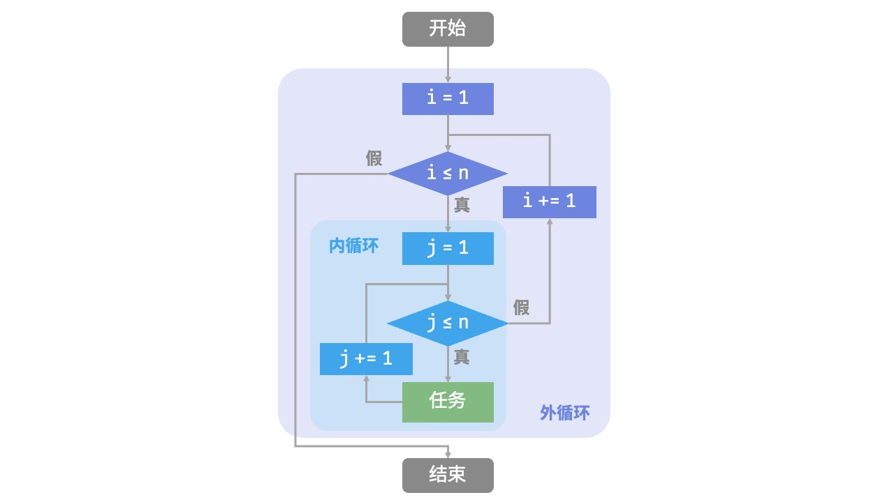

​	在这种情况下，函数的操作数量与 n2 成正比，或者说算法运行时间和输入数据大小 n 成“平方关系”。

​	我们可以继续添加嵌套循环，每一次嵌套都是一次“升维”，将会使时间复杂度提高至“立方关系”“四次方关系”，以此类推。

#### 递归

​	「递归 recursion」是一种算法策略，通过函数调用自身来解决问题。它主要包含两个阶段。

1. **递**：程序不断深入地调用自身，通常传入更小或更简化的参数，直到达到“终止条件”。
2. **归**：触发“终止条件”后，程序从最深层的递归函数开始逐层返回，汇聚每一层的结果。

而从实现的角度看，递归代码主要包含三个要素。

1. **终止条件**：用于决定什么时候由“递”转“归”。
2. **递归调用**：对应“递”，函数调用自身，通常输入更小或更简化的参数。
3. **返回结果**：对应“归”，将当前递归层级的结果返回至上一层。

观察以下代码，我们只需调用函数 recur(n)，就可以完成 1+2+⋯+n 的计算：

::: tabs#code

@tab c++

~~~c++
/* 递归 */
int recur(int n) {
    // 终止条件
    if (n == 1)
        return 1;
    // 递：递归调用
    int res = recur(n - 1);
    // 归：返回结果
    return n + res;
}
~~~

@tab java

~~~java
/* 递归 */
int recur(int n) {
    // 终止条件
    if (n == 1)
        return 1;
    // 递：递归调用
    int res = recur(n - 1);
    // 归：返回结果
    return n + res;
}
~~~

:::

以下展示了该函数的递归过程。

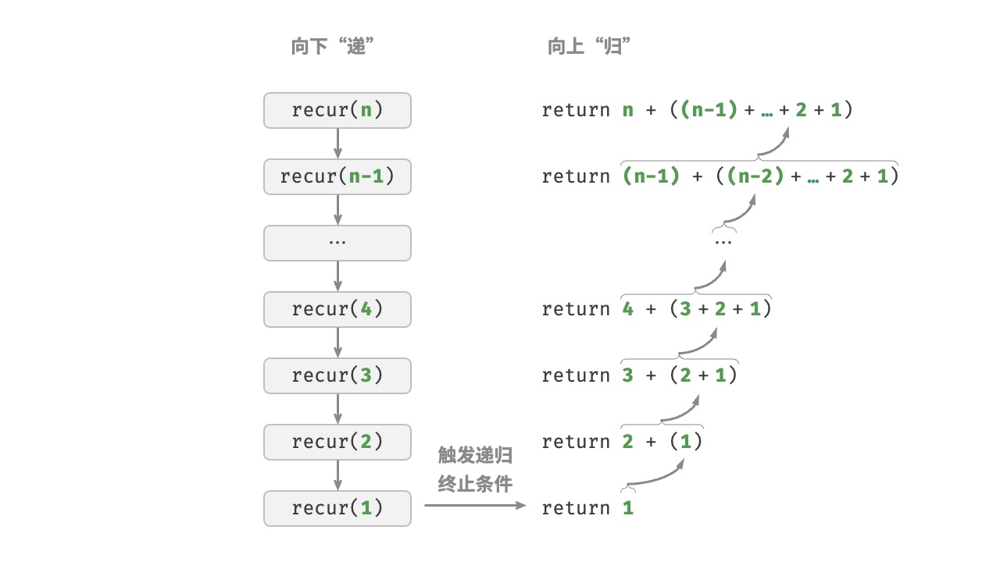

​	虽然从计算角度看，迭代与递归可以得到相同的结果，**但它们表达了两种完全不同的思考和解决问题的范式**。

- **迭代**：“自下而上”地解决问题。从最基础的步骤开始，然后不断重复或累加这些步骤，直到任务完成。
- **递归**：“自上而下”地解决问题。将原问题分解为更小的子问题，这些子问题和原问题具有相同的形式。接下来将子问题继续分解为更小的子问题，直到基本情况时停止（基本情况的解是已知的）。

##### 调用栈

​	递归函数每次调用自身时，系统都会为新开启的函数分配内存，以存储局部变量、调用地址和其他信息等。这将导致两方面的结果。

- 函数的上下文数据都存储在称为“栈帧空间”的内存区域中，直至函数返回后才会被释放。因此，**递归通常比迭代更加耗费内存空间**。
- 递归调用函数会产生额外的开销。**因此递归通常比循环的时间效率更低**。

如图所示，在触发终止条件前，同时存在 n 个未返回的递归函数，**递归深度为 n**。

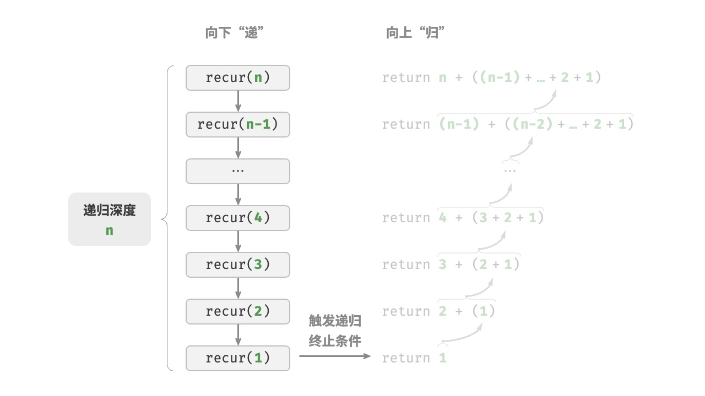

在实际中，编程语音允许的递归深度通常实施有限的，过深的递归可能导致栈溢出错误。

##### 尾递归

​	有趣的是，**如果函数在返回前的最后一步才进行递归调用**，则该函数可以被编译器或解释器优化，使其在空间效率上与迭代相当。这种情况被称为「尾递归 tail recursion」。

- **普通递归**：当函数返回到上一层级的函数后，需要继续执行代码，因此系统需要保存上一层调用的上下文。
- **尾递归**：递归调用是函数返回前的最后一个操作，这意味着函数返回到上一层级后，无须继续执行其他操作，因此系统无须保存上一层函数的上下文。

以计算 1+2+3+⋯+n 为例，我们可以将结果变量 res 设为函数参数，从而实现尾递归：

::: tabs#code

@tab c++

~~~c++
/* 尾递归 */
int tailRecur(int n, int res) {
    // 终止条件
    if (n == 0)
        return res;
    // 尾递归调用
    return tailRecur(n - 1, res + n);
}
~~~

@tab java

~~~java
/* 尾递归 */
int tailRecur(int n, int res) {
    // 终止条件
    if (n == 0)
        return res;
    // 尾递归调用
    return tailRecur(n - 1, res + n);
}
~~~

:::

​	尾递归的执行过程如下图所示。对比普通递归和尾递归，两者的求和操作的执行点是不同的。

- **普通递归**：求和操作是在“归”的过程中执行的，每层返回后都要再执行一次求和操作。
- **尾递归**：求和操作是在“递”的过程中执行的，“归”的过程只需层层返回。

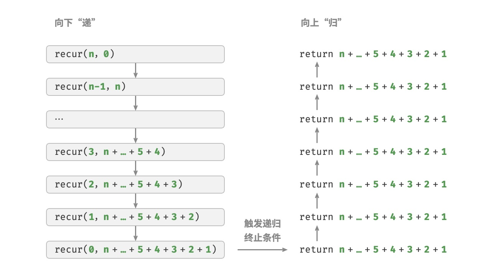

::: info 注

**Java 不支持尾递归优化，该溢出还是会溢出**

:::

##### 递归树

​	当处理与“分治”相关的算法问题时，递归往往比迭代的思路更加直观、代码更加易读。以“斐波那契数列”为例。

设斐波那契数列的第 n 个数字为 f(n)，易得两个结论。

- 数列的前两个数字为 f(1) = 0 和 f(2) = 1。
- 数列中的每个数字是前两个数字的和，即 f(n) = f(n - 1) + f(n - 2)。

按照递归关系进行递归调用，将前两个数字作为终止条件，便可写出递归代码。调用 fib(n) 即可得到斐波那契数列的第 n 个数字：

::: tabs#code

@tab c++

~~~c++
/* 斐波那契数列：递归 */
int fib(int n) {
    // 终止条件 f(1) = 0, f(2) = 1
    if (n == 1 || n == 2)
        return n - 1;
    // 递归调用 f(n) = f(n-1) + f(n-2)
    int res = fib(n - 1) + fib(n - 2);
    // 返回结果 f(n)
    return res;
}
~~~

@tab java

~~~java
/* 斐波那契数列：递归 */
int fib(int n) {
    // 终止条件 f(1) = 0, f(2) = 1
    if (n == 1 || n == 2)
        return n - 1;
    // 递归调用 f(n) = f(n-1) + f(n-2)
    int res = fib(n - 1) + fib(n - 2);
    // 返回结果 f(n)
    return res;
}
~~~

:::

​	观察以上代码，我们在函数内递归调用了两个函数，**这意味着从一个调用产生了两个调用分支**。如下图所示，这样不断递归调用下去，最终将产生一棵层数为 n 的「递归树 recursion tree」。

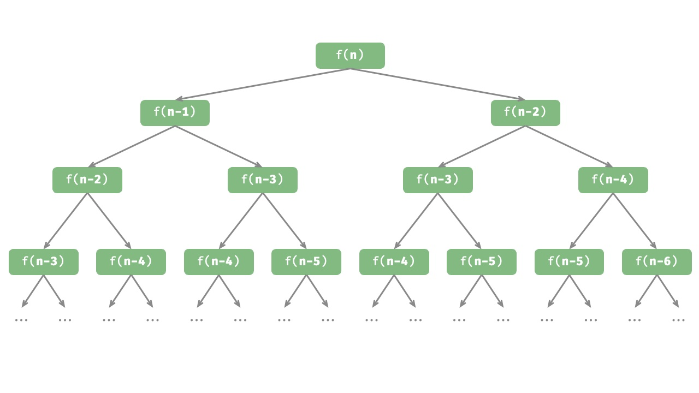

从本质上看，递归体现了“将问题分解为更小子问题”的思维范式，这种分治策略至关重要。

- 从算法角度看，搜索、排序、回溯、分治、动态规划等许多重要算法策略直接或间接地应用了这种思维方式。
- 从数据结构角度看，递归天然适合处理链表、树和图的相关问题，因为它们非常适合用分治思想进行分析。

##### 两者对比

总结以上内容，以下为对迭代和递归的特点对比

|          | 迭代                                   | 递归                                                         |
| -------- | -------------------------------------- | ------------------------------------------------------------ |
| 实现方式 | 循环结构                               | 函数调用自身                                                 |
| 时间效率 | 效率通常较高，无函数调用开销           | 每次函数调用都会产生开销                                     |
| 内存使用 | 通常使用固定大小的内存空间             | 累积函数调用可能使用大量的栈帧空间                           |
| 适用问题 | 适用于简单循环任务，代码直观、可读性好 | 适用于子问题分解，如树、图、分治、回溯等，代码结构简洁、清晰 |

以上述递归函数为例，求和操作在递归的“归”阶段进行。这意味着最初被调用的函数实际上是最后完成其求和操作的，**这种工作机制与栈的“先入后出”原则异曲同工**。

事实上，“调用栈”和“栈帧空间”这类递归术语已经暗示了递归与栈之间的密切关系。

1. **递**：当函数被调用时，系统会在“调用栈”上为该函数分配新的栈帧，用于存储函数的局部变量、参数、返回地址等数据。
2. **归**：当函数完成执行并返回时，对应的栈帧会被从“调用栈”上移除，恢复之前函数的执行环境。

因此，**我们可以使用一个显式的栈来模拟调用栈的行为**，从而将递归转化为迭代形式：

::: tabs#code

@tab c++

~~~c++
/* 使用迭代模拟递归 */
int forLoopRecur(int n) {
    // 使用一个显式的栈来模拟系统调用栈
    stack<int> stack;
    int res = 0;
    // 递：递归调用
    for (int i = n; i > 0; i--) {
        // 通过“入栈操作”模拟“递”
        stack.push(i);
    }
    // 归：返回结果
    while (!stack.empty()) {
        // 通过“出栈操作”模拟“归”
        res += stack.top();
        stack.pop();
    }
    // res = 1+2+3+...+n
    return res;
}
~~~

@tab java

~~~java
/* 使用迭代模拟递归 */
int forLoopRecur(int n) {
    // 使用一个显式的栈来模拟系统调用栈
    Stack<Integer> stack = new Stack<>();
    int res = 0;
    // 递：递归调用
    for (int i = n; i > 0; i--) {
        // 通过“入栈操作”模拟“递”
        stack.push(i);
    }
    // 归：返回结果
    while (!stack.isEmpty()) {
        // 通过“出栈操作”模拟“归”
        res += stack.pop();
    }
    // res = 1+2+3+...+n
    return res;
}
~~~

:::

观察以上代码，当递归转化为迭代后，代码变得更加复杂了。尽管迭代和递归在很多情况下可以互相转化，但不一定值得这样做，有以下两点原因。

- 转化后的代码可能更加难以理解，可读性更差。
- 对于某些复杂问题，模拟系统调用栈的行为可能非常困难。

总之，**选择迭代还是递归取决于特定问题的性质**。在编程实践中，权衡两者的优劣并根据情境选择合适的方法至关重要。

### 时间复杂度

运行时间可以直观且准确地反映算法的效率。以下为估算代码运行速度的操作：

1. **确定运算平台**，包括硬件配置、编程语言、系统环境等，这些因素都会影响代码的运行效率。
2. **评估各种计算操作所需的运行时间**，例如加法操作 + 需要 1ns，乘法操作 * 需要 10 ns，打印操作 print() 需要 5ns 等。
3. **统计代码中所有的计算操作**，并将所有操作的执行时间求和，从而得到运行时间。

例如在以下代码中，输入数据大小为 n：

::: tabs#code

@tab c++

~~~c++
// 在某运行平台下
void algorithm(int n) {
    int a = 2;  // 1 ns
    a = a + 1;  // 1 ns
    a = a * 2;  // 10 ns
    // 循环 n 次
    for (int i = 0; i < n; i++) {  // 1 ns ，每轮都要执行 i++
        cout << 0 << endl;         // 5 ns
    }
}
~~~

@tab java

~~~java
// 在某运行平台下
void algorithm(int n) {
    int a = 2;  // 1 ns
    a = a + 1;  // 1 ns
    a = a * 2;  // 10 ns
    // 循环 n 次
    for (int i = 0; i < n; i++) {  // 1 ns ，每轮都要执行 i++
        System.out.println(0);     // 5 ns
    }
}
~~~

:::

根据以上方法，可以得到算法的运行时间为 (6n + 12)ns：
$$
1 + 1 + 10 +(1 + 5) * n = 6n + 12
$$
但实际上，**统计算法的运行时间既不合理也不现实**。首先，我们不希望将预估时间的运行平台判定，因为算法需要再各种不同的平台上运行。其次，我们很难获知每种操作的运行时间，这给预估过程带来了极大的难度。

#### 统计时间增长趋势

时间复杂度分析统计的不是算法运行时间，**而是算法运行时间随着数据量变大时的增长趋势**。

“时间增长趋势”这个概念比较抽象，我们通过一个例子来加以理解。假设输入数据大小为 n，给定三个算法 A、B 和 C：

::: tabs#code

@tab c++

~~~c++
// 算法 A 的时间复杂度：常数阶
void algorithm_A(int n) {
    cout << 0 << endl;
}
// 算法 B 的时间复杂度：线性阶
void algorithm_B(int n) {
    for (int i = 0; i < n; i++) {
        cout << 0 << endl;
    }
}
// 算法 C 的时间复杂度：常数阶
void algorithm_C(int n) {
    for (int i = 0; i < 1000000; i++) {
        cout << 0 << endl;
    }
}
~~~

@tab java

~~~java
// 算法 A 的时间复杂度：常数阶
void algorithm_A(int n) {
    System.out.println(0);
}
// 算法 B 的时间复杂度：线性阶
void algorithm_B(int n) {
    for (int i = 0; i < n; i++) {
        System.out.println(0);
    }
}
// 算法 C 的时间复杂度：常数阶
void algorithm_C(int n) {
    for (int i = 0; i < 1000000; i++) {
        System.out.println(0);
    }
}
~~~

:::

下图展示了以上三个算法函数的时间复杂度。

- 算法 A：只有 1 个打印操作，算法运行时间不随着 n 增大而增长。我们称此算法的时间复杂度为“常数阶”。
- 算法 B：打印操作需要循环 n 次，算法运行时间随着 n 增大呈线性增长。此算法的时间复杂度被称为“线性阶”。
- 算法 C：打印操作需要循环 1000000 次，虽然运行时间很长，但它与输入数据大小 n 无关。因此 C 的时间复杂度和 A 相同，仍为“常数阶”。

相较于直接统计算法的运行时间，时间复杂度分析有以下特点：

- **时间复杂度能够有效评估算法效率**。例如，算法 B 的运行时间呈线性增长，在 n>1 时比算法 A 更慢，在 n>1000000 时比算法 C 更慢。事实上，只要输入数据大小 n 足够大，复杂度为“常数阶”的算法一定优于“线性阶”的算法，这正是时间增长趋势的含义。
- **时间复杂度的推算方法更简便**。显然，运行平台和计算操作类型都与算法运行时间的增长趋势无关。因此在时间复杂度分析中，我们可以简单地将所有计算操作的执行时间视为相同的“单位时间”，从而将“计算操作运行时间统计”简化为“计算操作数量统计”，这样一来估算难度就大大降低了。
- **时间复杂度也存在一定的局限性**。例如，尽管算法 A 和 C 的时间复杂度相同，但实际运行时间差别很大。同样，尽管算法 B 的时间复杂度比 C 高，但在输入数据大小 n 较小时，算法 B 明显优于算法 C 。在这些情况下，我们很难仅凭时间复杂度判断算法效率的高低。当然，尽管存在上述问题，复杂度分析仍然是评判算法效率最有效且常用的方法。

#### 函数渐近上界

给定一个输入大小为 n 的函数：

::: tabs#code

@tab c++

~~~c++
void algorithm(int n) {
    int a = 1;  // +1
    a = a + 1;  // +1
    a = a * 2;  // +1
    // 循环 n 次
    for (int i = 0; i < n; i++) { // +1（每轮都执行 i ++）
        cout << 0 << endl;    // +1
    }
}
~~~

@tab java

~~~java
void algorithm(int n) {
    int a = 1;  // +1
    a = a + 1;  // +1
    a = a * 2;  // +1
    // 循环 n 次
    for (int i = 0; i < n; i++) { // +1（每轮都执行 i ++）
        System.out.println(0);    // +1
    }
}
~~~

:::

设算法的操作数量是一个关于输入数据大小 n 的函数，记为 T(n)，则以上函数的操作数量为：
$$
T(n) = 3 +2n
$$
​	T(n) 是一次函数，说明其运行时间的增长趋势是线性的，因此它的时间复杂度是线性阶。

​	我们将线性阶的时间复杂度记为 O(n)，这个数学符号称为「大 O 记号 big-O notation」，表示函数 T(n) 的渐近上界「 asymptotic upper bound」。

​	时间复杂度分析本质上是计算“操作数量 T(n)”的渐近上界，它具有明确的数学定义。

::: info 

​	若存在正实数 c 和实数 n0，均有 T(n)≤c·f(n)，则可认为 f(n) 给出了 T(n) 的一个渐进上界，记为 T(n)=O(f(n))。

:::

​	如下图所示，计算渐近上界就是寻找一个函数 f(n)，使得当 n 趋向于无穷大时，T(n) 和 f(n) 处于相同的增长级别，仅相差一个常数项 c 的倍数。

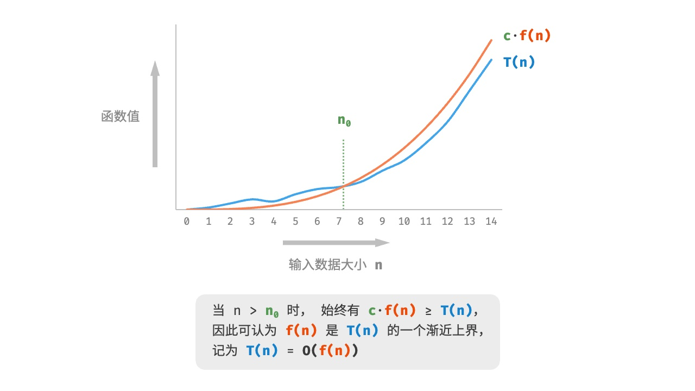

#### 推算方法

​	根据定义，确定 f(n) 之后，我们便可得到时间复杂度 O(f(n))。而确定渐近上界 f(n) 的操作分两步：首先统计操作数量，然后判断渐近上界。

##### 统计操作数量

​	针对代码，逐行从上到下的计算即可。然而，由于上述 c·f(n) 中的常数项 c 可以取任意大小，**因此操作数量 T(n) 中的各种系数、常数项都可以忽略。** 根据测原则，可以总结出以下计数简化技巧。

1. **忽略 T(n) 中的常数项。** 因为它们都与 n 无关，所以对时间复杂度不产生影响。
2. **省略所有系数**。例如，循环 2n 次、5n+1 次等，都可以简化记为 n 次，因为 n 前面的系数对时间复杂度没有影响。
3. **循环嵌套时使用乘法**。总操作数量等于外层循环和内层循环操作数量之积，每一层循环依然可以分别套用第 1. 点和第 2. 点的技巧。

给定一个函数，我们可以用上述技巧来统计操作数量：

::: tabs#code

@tab c++

~~~C++
void algorithm(int n) {
    int a = 1;  // +0（技巧 1）
    a = a + n;  // +0（技巧 1）
    // +n（技巧 2）
    for (int i = 0; i < 5 * n + 1; i++) {
        cout << 0 << endl;
    }
    // +n*n（技巧 3）
    for (int i = 0; i < 2 * n; i++) {
        for (int j = 0; j < n + 1; j++) {
            cout << 0 << endl;
        }
    }
}
~~~

@tab java

~~~java
void algorithm(int n) {
    int a = 1;  // +0（技巧 1）
    a = a + n;  // +0（技巧 1）
    // +n（技巧 2）
    for (int i = 0; i < 5 * n + 1; i++) {
        System.out.println(0);
    }
    // +n*n（技巧 3）
    for (int i = 0; i < 2 * n; i++) {
        for (int j = 0; j < n + 1; j++) {
            System.out.println(0);
        }
    }
}
~~~

:::

以下公式展示了使用上述技巧后的统计结果，两者推算出的时间复杂度都为 O(n2)。

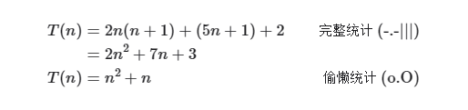

##### 判断渐近上界

​	**时间复杂度由 T(n) 中最高阶的项来决定**。这是因为在 n 趋于无穷大时，最高阶的项将发挥主导作用，其他项的影响都可以忽略。

​	下表展示了一些例子，其中一些夸张的值是为了强调“系数无法撼动阶数”这一结论。当 n 趋于无穷大时，这些常数变得无足轻重。

| 操作数量 T(n)                          | 时间复杂度 O(f(n)) |
| -------------------------------------- | ------------------ |
| 100000                                 | O(1)               |
| 3n + 2                                 | O(n)               |
| 2n2 + 3n + 2                | O(n2)   |
| n3 + 10000n2     | O(n3)   |
| 2n + 10000n10000 | O(2n)   |

#### 常见类型

设输入数据大小为 n ，常见的时间复杂度类型如图所示（按照从低到高的顺序排列）。

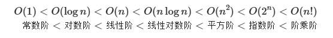

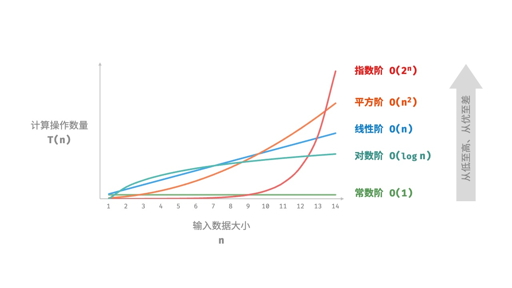

##### 常数阶 O(1)

​	常数阶的操作数量与输入数量大小 n 无关，即不随着 n 的变化而变化。

​	在以下函数中，尽管操作数量 size 可能很打，但由于其与输入数据大小 n 无关，因此时间复杂度仍为 O(1)：

::: tabs#code

@tab c++

~~~c++
/* 常数阶 */
int constant(int n) {
    int count = 0;
    int size = 100000;
    for (int i = 0; i < size; i++)
        count++;
    return count;
}
~~~

@tab java

~~~java
/* 线性阶 */
int linear(int n) {
    int count = 0;
    for (int i = 0; i < n; i++)
        count++;
    return count;
}
~~~

:::

遍历数组和遍历链表等操作的时间复杂度均为 O(n)，其中 n 为数组或链表的长度：

::: tabs#code

@tab c++

~~~c++
/* 线性阶（遍历数组） */
int arrayTraversal(vector<int> &nums) {
    int count = 0;
    // 循环次数与数组长度成正比
    for (int num : nums) {
        count++;
    }
    return count;
}
~~~

@tab java

~~~java
/* 线性阶（遍历数组） */
int arrayTraversal(int[] nums) {
    int count = 0;
    // 循环次数与数组长度成正比
    for (int num : nums) {
        count++;
    }
    return count;
}
~~~

:::

​	值得注意的是，**输入数据大小 n 需根据输入数据的类型来具体确定**。比如在第一个示例中，变量 n 为输入数据大小；在第二个示例中，数组长度 n 为数据大小。

##### 平方阶 O(n2)

平方阶的操作数量相对于输入数据大小 n 以平方级别增长。平方阶通常出现在嵌套循环中，外层循环和内层循环的时间复杂度都为 O(n2)，因此总体的时间复杂度为 O(n2)：

::: tabs#code

@tab c++

~~~c++
/* 平方阶 */
int quadratic(int n) {
    int count = 0;
    // 循环次数与数组长度成平方关系
    for (int i = 0; i < n; i++) {
        for (int j = 0; j < n; j++) {
            count++;
        }
    }
    return count;
}
~~~

@tab java

~~~java
/* 平方阶 */
int quadratic(int n) {
    int count = 0;
    // 循环次数与数组长度成平方关系
    for (int i = 0; i < n; i++) {
        for (int j = 0; j < n; j++) {
            count++;
        }
    }
    return count;
}
~~~

:::

下图对比了常数阶、线性阶和平方阶三种时间复杂度。

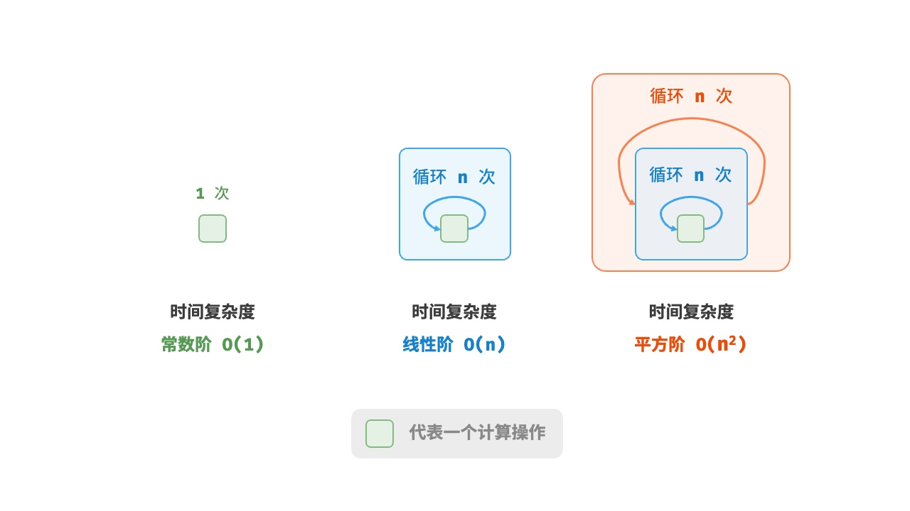

